# Trusted Zero Touch Provisioning (Trusted ZTP) for SONiC

## High Level Design Document

**Feature:** Trusted Zero Touch Provisioning (Trusted ZTP) for SONiC

**Version:** 1.0

**Status:** Draft — submitted for SONiC community HLD review

**Target release:** To be assigned by the SONiC TSC


---

## Table of Contents

1. [Revision History](#1-revision-history)
2. [About This Document](#2-about-this-document)
3. [Scope](#3-scope)
4. [Definitions and Abbreviations](#4-definitions-and-abbreviations)
5. [Overview](#5-overview)
6. [Requirements](#6-requirements)
7. [Architecture](#7-architecture)
8. [High-Level Design](#8-high-level-design)
9. [SAI API](#9-sai-api)
10. [Implementation Phasing](#10-implementation-phasing)
11. [Configuration and Management](#11-configuration-and-management)
12. [Warmboot and Fastboot Design Impact](#12-warmboot-and-fastboot-design-impact)
13. [Restrictions/Limitations](#14-restrictions-/-limitations)
14. [Testing Requirements](#15-testing-requirements)
15. [Open/Action items](#16-open-/-action-items)
16. [Appendix A](#16-appendix-a-the-core-concept-of-trusted-ztp-Device-Identity-=-Serial-Number-Embedded-in-a-Certificate)
17. [Appendix B](#17-appendix-b-pki-trust-hierarchy)
18. [Appendix C](#18-appendix-c-how-phase1-works-without-a-TPM)
19. [Appendix D](#19-appendix-d-device-configuration-using-voucher-anchor-mode)
20. [Appendix E](#20-appendix-e-device-configuration-using-trusted-server-mode)
    
### 1. Revision History  

| Version | Date | Author | Description |
|:-------:|:-----|:-------|:------------|
| 1.0 | 2026-08-06 | T Keerthi Kumar, Sandeep K | Initial draft. |


### 2. About This Document  

This High-Level Design (HLD) introduces **Trusted ZTP (tZTP)**, a standards-based and cryptographically secure onboarding solution for SONiC built on **RFC 8572 Secure Zero Touch Provisioning (SZTP)**.

The design follows a conservative and low-risk approach that prioritizes security, maintainability, and backward compatibility. Rather than replacing SONiC's existing `sonic-ztp` framework, Trusted ZTP extends and enhances it with standards-compliant security controls.

Key design principles include:

- **Augmentation rather than replacement**: Trusted ZTP builds on the existing `sonic-ztp` service instead of introducing an entirely new onboarding framework.
- **Reuse of proven technology**: The design leverages an existing, mature, and permissively licensed RFC 8572 implementation rather than developing a new security-sensitive provisioning protocol from scratch.
- **Standards-based onboarding**: Device onboarding, ownership validation, and secure configuration delivery follow the RFC 8572 specification.
- **Backward compatibility**: Existing SONiC ZTP deployments continue to operate unchanged.
- **Secure-by-option deployment**: Trusted ZTP is disabled by default and must be explicitly enabled.
- **Reduced implementation risk**: Reusing established components minimizes development complexity and limits exposure to security vulnerabilities in custom protocol implementations.

Key design Goals of Trusted ZTP aims to:

1. Provide cryptographically verifiable device onboarding.
2. Establish device ownership through secure ownership vouchers.
3. Protect onboarding communications using modern TLS-based security.
4. Integrate with SONiC's existing provisioning workflow with minimal/no disruptions.
5. Preserve compatibility with current deployment models while enabling organizations to adopt stronger security controls when required.


### 3. Scope  

This document describes **Phase 1** of Trusted Zero Touch Provisioning (tZTP) for SONiC userspace. tZTP extends the existing `sonic-ztp` with cryptographic security with full backward compatibility support.


**In scope — Phase 1 (this document):**

- RFC 8572 secure bootstrapping on the SONiC device (the *pledge*), over authenticated TLS 1.3 to a bootstrap server (mutual TLS with the IDevID in Phase 2).
- Validation of the ownership voucher, the owner certificate, and the CMS signature over the onboarding payload, before any configuration is applied.
- Integration with the existing `sonic-ztp` engine and its plugin model, so that validated payloads are applied through today's provisioning path.
- An immutable first-boot trust plane (`bootstrap.json`), support for both RFC 8572 trust models, and trusted-time handling for clock-less first boot.
- Operational visibility in STATE_DB with a durable audit trail, and supports through the CLI.
- DHCP Option 143 (`sztp-redirect`, RFC 8572 §8.1 structured URI list) strict enforcement in trusted mode
- A secure-enable enforcement mode that disables the legacy insecure discovery and transport paths.
- Full backward compatibility with existing ZTP deployments, in secure-disable mode.
- Operation on hardware **without** a TPM, using a file-based device certificate.

**In scope — Phase 2 (design seams defined here; full design in a follow-up HLD):**

- Hardware-rooted device identity using TPM 2.0 and IEEE 802.1AR IDevID/LDevID, with certificate enrollment and renewal.

**Out of scope:**

- The bootstrap server implementation itself, which runs off the device.
- Securing the ONIE-stage NOS image download. 
 
---
### 4. Definitions/Abbreviations 

| Term | Definition |
|------|-----------|
| **tZTP** | Trusted Zero Touch Provisioning — this feature |
| **ZTP** | Zero Touch Provisioning — existing SONiC mechanism (unsecured) |
| **SZTP** | Secure Zero Touch Provisioning — RFC 8572 standard that tZTP implements |
| **IDevID** | Initial Device Identifier — factory-installed, TPM-backed per IEEE 802.1AR-2018 |
| **LDevID** | Local Device Identifier — operational cert issued at provisioning per IEEE 802.1AR-2018 |
| **mTLS** | Mutual TLS — TLS with both client and server certificate verification |
| **EST** | Enrollment over Secure Transport — RFC 7030 |
| **CMS** | Cryptographic Message Syntax — RFC 5652, used for signed config bundles |
| **TPM** | Trusted Platform Module 2.0 — hardware security element |
| **ONIE** | Open Network Install Environment — bare-metal switch bootloader |
| **PKI** | Public Key Infrastructure |
| **CA** | Certificate Authority |
| **CSR** | Certificate Signing Request (PKCS#10) |
| **ztpd** | ZTP Daemon — existing SONiC Python daemon (`sonic-ztp` package) |
| **RFC 8572** | Secure Zero Touch Provisioning |
| **RFC 9646** | CSR in SZTP Bootstrapping Request (Oct 2024) |
| **RFC 8366** | Voucher Artifact for Bootstrapping Protocols |
| **CONFIG_DB** | SONiC configuration database (Redis instance 4) |
| **STATE_DB** | SONiC operational state database (Redis instance 6) |
| **Pledge** | The device being provisioned — here, the SONiC switch. |
| **Bootstrap server** | The RFC 8572 server that returns redirect or onboarding information to the pledge. |
| **Onboarding information** | The signed payload delivered to the pledge: boot image reference, configuration, and optional scripts. |
| **Ownership voucher** | A signed artifact (RFC 8366) that binds a device to its rightful owner. |
| **Trusted-server model** | RFC 8572 trust where the pledge already holds the owner/CA trust anchor. |
| **Voucher-anchored model** | RFC 8572 trust where the server is verified *after* connecting, by validating the voucher. |
| **Owner / owner certificate** | The entity that owns the deployed device and signs its onboarding information; identified by the voucher's `pinned-domain-cert`. |
| **pinned-domain-cert** | The certificate pinned inside the ownership voucher (RFC 8366) that identifies the owner the device must trust. |
| **Manufacturer anchor** | The manufacturer signing trust anchor, baked in at the factory, used to verify the ownership voucher. |
| **CMS SignedData** | The RFC 5652 signed structure wrapping the onboarding information; its signer must be the owner certificate. |
| **Canonical Architecture** | An architecture that uses a single, standard, and shared model for data or design. |
| **HLD** | High Level Design document |

---

### 5. Overview 

### 5.1 The Existing SONiC ZTP Service

SONiC's existing Zero Touch Provisioning (ZTP) automates first-boot configuration of bare-metal switches i.e. it lets a factory-fresh SONiC switch configure itself with no operator interaction. You rack it, cable it, power it on. It uses DHCP to discover where its configuration lives, downloads a provisioning definition (the ZTP JSON), executes an ordered series of plugins — install firmware, load config_db.json, load a minigraph, set SNMP, run custom scripts — and finally hands control to the real, provisioned configuration.

The central design idea: ZTP is temporary scaffolding. It installs a throwaway “ZTP profile” configuration (just enough to bring links up and run DHCP), does its work, then removes itself and reloads the configuration it produced. 

It is widely adopted across data centre deployments. However, as SONiC expands into enterprise, regulated, and edge environments, the current implementation's lack of cryptographic security prevents adoption in security-sensitive contexts.


### 5.2 Motivation: Security Gaps in Today's ZTP (`sonic-ztp`) 

#### Current ZTP Architecture

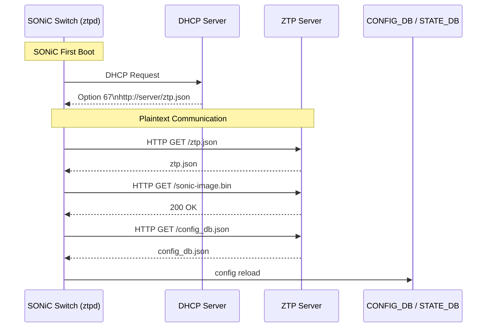
*Figure 1 — SONiC ZTP Initial Provisioning Sequence*

The existing ZTP flow is functional but **insecure by default** i.e. **Zero touch** is **easy**, but **Zero trust** is the **hard part**. Its discovery relies on DHCP options transmitted in cleartext (DHCPv4 option 67 for the configuration URL, option 66 for a TFTP server, option 239 for a provisioning script; DHCPv6 option 59). It supports unauthenticated transports — HTTP, TFTP, and FTP — alongside HTTPS and SCP, and uses curl to download provisioning data.

Existing plain ZTP has the following trust problems: 

**Threat 1 · rogue server**
The DEVICE trusts whatever server the network points it to i.e. the device trusts anyone who answers via DHCP. Point it at a malicious server and it installs the attacker's image as its "operating system." The box is now owned before it ever joins the network.

**Threat 2 · rogue device**
The server hands an OS + config to anyone who asks. A stolen or counterfeit device asks for onboarding data and walks away with your golden config and firmware.

SONiC ZTP does not rely entirely on standard security mechanisms. Instead, it uses a custom security model with the following protections:

- Configuration files hosted on the provisioning server can be optionally encrypted using **AES encryption**.
- Files can be digitally signed using **RSA/SHA-512 signatures** to ensure their integrity and authenticity.
- SONiC can optionally verify the HTTPS server certificate before downloading files.

> **Important:** HTTPS certificate verification can be disabled by setting the following option: `secure: false` within ZTP JSON file i.e. used at ZTP sections such as firmware, config, plugin, or file downloads.

> When 'secure:false' is set, the downloader performs HTTPS downloads without validating the server's TLS certificate (curl -k). Encryption still exists, but the switch does not verify that it is communicating with the legitimate provisioning server.

There is no in-band mechanism for a factory-fresh device to establish who it is talking to or whether the payload legitimately belongs to it. Consequently, an attacker positioned on the provisioning network can serve a malicious image or configuration to a switch during its most vulnerable moment — first boot.

The table below states each gap and how Trusted ZTP closes it. The final column indicates the phase in which the gap is fully addressed.

| # | Security gap | Today | Trusted ZTP resolution | Phase |
|:--|:-------------|:------|:-----------------------|:-----:|
| G1 | Device impersonation — any host can request configuration | No device authentication | The config is bound to the device by the voucher's serial; a per-unit file cert (Phase 1) or TPM IDevID (Phase 2) carries that serial | 1 (file) → 2 (IDevID) |
| G2 | Rogue bootstrap server — any server is trusted | No server authentication | Server is trusted only via a pinned owner/CA anchor or a validated ownership voucher | 1 |
| G3 | Cleartext transmission | HTTP / TFTP / FTP permitted | TLS 1.3 only (mutual auth with the IDevID in Phase 2) | 1 |
| G4 | No payload integrity | Files applied as received | RFC 8572 signed onboarding information (CMS) plus voucher | 1 |
| G5 | No identity after provisioning | Shared credentials or manual certificates | LDevID issued for gNMI/RESTCONF | 2 |
| G6 | Insecure discovery | DHCP option 67 / 239 | DHCP option 143 / 136 (RFC 8572), mandatory in enforced mode | 1 |

> **On G1 in Phase 1:** device identity rests on the voucher's serial binding, carried by a per-unit *file* certificate — software-strength. Hardware-bound identity that fully closes G1 arrives with the TPM IDevID in Phase 2.


### 5.3 What Trusted ZTP Adds

tZTP (Trusted ZTP) is a security extension to the existing ZTP mechanism. It implements RFC 8572 (SZTP) in SONiC userspace — adding **secure discovery and trust-establishment stage in front of** that existing service — while remaining fully backward compatible with existing ZTP deployments. Conceptually, today's ZTP performs *"DHCP hands me a URL, I download a configuration."* Trusted ZTP performs *"DHCP hands me a bootstrap server, the device and server prove their identities to each other, and I download a cryptographically signed configuration that I verify against an ownership voucher before applying anything."*


```text
                          ┌──────────────────────────────────────────────┐
                          │            THE "NETWORK" (owner side)        │
                          │                                              │
    ┌──────────┐  DHCP    │  ┌────────────┐   ┌──────────────┐           │
    │  DEVICE  │◄────────►│  │ DHCP Server│   │ Redirect     │           │
    │          │ option143│  │  (dhcpd)   │   │ Server       │──┐        │
    │          │          │  └────────────┘   │(sztpd:8080)  │  │        │
    │          │          │                   └──────────────┘  │        │
    │ runs     │ mutual   │                   ┌──────────────┐◄─┘        │
    │ sZTP     │◄─TLS────►│                   │ Bootstrap    │           │
    │ AGENT    │ RFC8572  │                   │ Server       │           │
    │  (Go)    │          │                   │(sztpd:9090)  │           │
    └────┬─────┘          │                   └──────┬───────┘           │
         │                │                          │ points to         │
         │ HTTPS download │                   ┌──────▼───────┐           │
         └───────────────►│                   │ File Server  │           │
          boot image,     │                   │ Apache TLS   │           │
          config,scripts  │                   │    :443      │           │
                          │                   └──────────────┘           │
                          │ Helpers: swtpm (software TPM)                │
                          └──────────────────────────────────────────────┘
```
*Figure 2 : The Big Picture — The Players of Secure Zero Touch Provisioning sequence*


Crucially, **once the payload is validated, nothing about how SONiC applies configuration changes**. The validated payload is translated into SONiC's normal provisioning data and handed to the existing engine and plugins. The new work is confined to *establishing trust and obtaining a verified payload* — not to reimplementing provisioning.

#### The Trusted ZTP flow in four moves

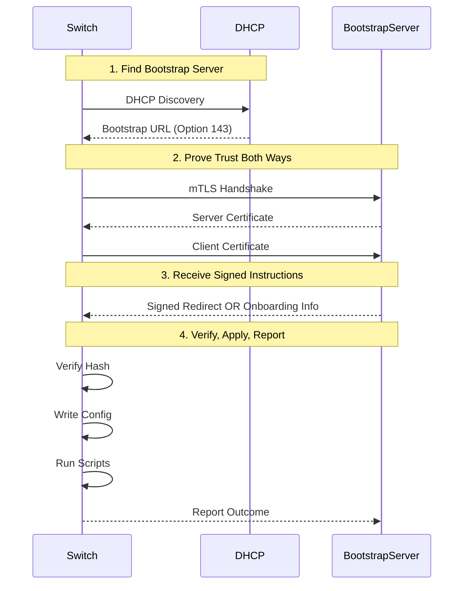
*Figure 3 : Trusted SONiC Bootstrapping Sequence with Mutual TLS*

##### 01. Find the bootstrap server

DHCP hands the switch a single thing: a **URL** (via option 143). Here DHCP is treated as *untrusted* — just a pointer, nothing more.

##### 02. Prove trust both ways

The switch and the server open a **mutual-TLS** connection. Each presents a certificate the other checks. Only if both sides are satisfied does the conversation continue.

##### 03. Receive signed instructions

The server sends **"conveyed information"** — a signed package that's either:

- A **redirect** ("go ask this other server instead"), or
- **Onboarding info** (the actual boot image + config + scripts)

##### 04. Verify, apply, report

The switch downloads the image, **checks its hash**, **writes the config**, **runs pre/post scripts**, and **tells the server** each stage's outcome.

#### Naming — tZTP vs sZTP

The feature is named **tZTP (Trusted ZTP)** rather than sZTP to emphasise that the trust model is the primary contribution: device identity, chain-of-trust from vendor through operator to device, and cryptographically provable configuration provenance. "Secure" is a property of the channel; "Trusted" is a property of the entire provisioning relationship.


### 6. Requirements

### 6.1 Functional Requirements

| # | Requirement | Priority |
|:--|:------------|:--------:|
| FR-1 | With Trusted ZTP disabled (`trusted_mode=false`, the default), the existing ZTP behaviour is completely unchanged. | Must |
| FR-2 | The device shall perform RFC 8572 secure bootstrapping against one or more bootstrap servers. | Must |
| FR-3 | The device shall be identifiable to the server through its ownership voucher's serial binding. Where a device identity certificate is available — an IEEE 802.1AR IDevID (Phase 2) or a per-unit file certificate (Phase 1) — it shall be presented for TLS client authentication. RFC 8572 does **not** require mutual TLS on the signed-data path. | Must |
| FR-4 | The server shall be authenticated either by validating its certificate against a pinned trust anchor (trusted-server model) or by validating the ownership voucher and then retroactively verifying the server (voucher-anchored model, RFC 8572 §5.4). | Must |
| FR-5 | The device shall validate the RFC 8366 ownership voucher, the owner certificate, and the CMS signature over the onboarding information before applying any part of the payload. | Must |
| FR-6 | On any trust-validation failure, the device shall apply no configuration, image, or script (fail-closed). | Must |
| FR-7 | The device shall accept an SZTP redirect and follow the referenced bootstrap servers (bounded to prevent loops). | Must |
| FR-8 | The device shall send RFC 8572 progress reports to a **trusted** bootstrap server (report-progress is defined only over the authenticated connection to a trusted server; it is not available on the signed-data-from-untrusted-server path). | Must |
| FR-9 | Validated onboarding information shall be applied through the existing `sonic-ztp` engine and plugins, with configuration backup and rollback on failure. | Must |
| FR-10 | In enforced mode, the SZTP URL shall be accepted only from DHCP option 143/136; legacy option 67/239 discovery shall be rejected. | Must |
| FR-11 | The initial trust posture shall be read from a read-only `bootstrap.json` at first boot; when `enforce=true` and the trust plane is missing or invalid, the device shall fail closed. | Must |
| FR-12 | The device shall establish trusted time on a clock-less first boot, anchoring to the voucher `created-on` timestamp when the real-time clock is invalid. | Must |
| FR-13 | TLS 1.3 shall be the minimum negotiated version; TLS 1.2 and below shall be rejected. | Must |
| FR-14 | All SONiC modules shall interact with the RFC 8572 client only through a single adapter, so that the client can be replaced without changes elsewhere. | Must |
| FR-15 | Trusted ZTP status, trust results, and an audit trail shall be published to STATE_DB, mirrored durably to the system log, and exposed via CLI. | Must |
| FR-16 | (Phase 2) The device shall support TPM-resident IDevID identity and LDevID enrollment/renewal via EST. | Should |
| FR-17 | Any additional files delivered with the onboarding information shall be covered by the same CMS signature over the conveyed information and shall be rejected if that signature does not verify. | Should |
| FR-18 | The network-facing bootstrapping and parsing (TLS, voucher, CMS, JSON) shall run with reduced privilege — dropped capabilities and a sandbox — separated from the root engine that applies configuration. | Must |
| FR-19 | Trusted time derived from a voucher shall never move the clock backward past the last persisted known-good time (a monotonic floor), to prevent clock-rollback replay. | Must |
| FR-20 | Execution of onboarding pre/post-configuration scripts shall be governed by an `allow_onboarding_scripts` policy; when enabled, scripts run with the engine's (root) privilege. | Should |

### 6.2 Non-Functional Requirements

| # | Requirement | Target |
|:--|:------------|:-------|
| NFR-1 | Backward compatibility with existing deployments | 100% |
| NFR-2 | All new source is Apache-2.0 (or compatible permissive) and free of GPL or proprietary entanglement | Required |
| NFR-3 | No component that cannot be shipped upstream is required on the device | Required |
| NFR-4 | The reused client is vendored at a pinned version; its transitive-dependency licenses are audited in CI | Required |
| NFR-5 | Phase 1 functions on hardware without a TPM or factory IDevID | Required |
| NFR-6 | The feature is unit-testable without a live TPM, network, or bootstrap server (adapter mocked) | Required |
| NFR-7 | Audit records survive cold reboot and power loss | Required |
| NFR-8 | End-to-end provisioning completes within a typical maintenance window | < 5 minutes |

---

### 7. Architecture Design 

Trusted ZTP is an additive, management-plane feature. This section places it in the SONiC architecture, zooms into its internal components and secure data flow in next sectinos.

Trusted ZTP operates entirely in the SONiC **management plane**. It has no interaction with the ASIC, SAI, `orchagent`, or `syncd`. It reads and writes CONFIG_DB and STATE_DB, reads trust material from the filesystem, and — in Phase 2 — uses the TPM. Its only external interaction is an outbound TLS session to the bootstrap server. 

Because the ZTP process handles data received from potentially untrusted networks during initial device boot, the network-facing bootstrap and file-parsing components are designed to run with limited privileges and within a sandboxed environment i.e.

- Network-sourced data is processed in a restricted environment with minimal privileges.
- The bootstrap and parsing components are isolated from critical system functions.
- The root-level configuration engine is separated from the network-facing components.
- If a vulnerability is exploited in the provisioning or parsing process, the impact is limited by the sandbox and privilege restrictions.
- This reduces the risk of unauthorized access to the underlying operating system during the initial provisioning phase.


#### Footprint on the SONiC Architecture

The SONiC community's canonical architecture organises the system as application containers interacting through a **central Redis database**, above the SWSS / `syncd` / SAI stack and the ASIC. Trusted ZTP fits into that picture with a deliberately small footprint: it extends the existing **native `sonic-ztp` host service**, adds a CLI, and adds tables to **CONFIG_DB** and **STATE_DB**. Everything below the database — SWSS, `syncd`, SAI, and the ASIC — **is untouched**.

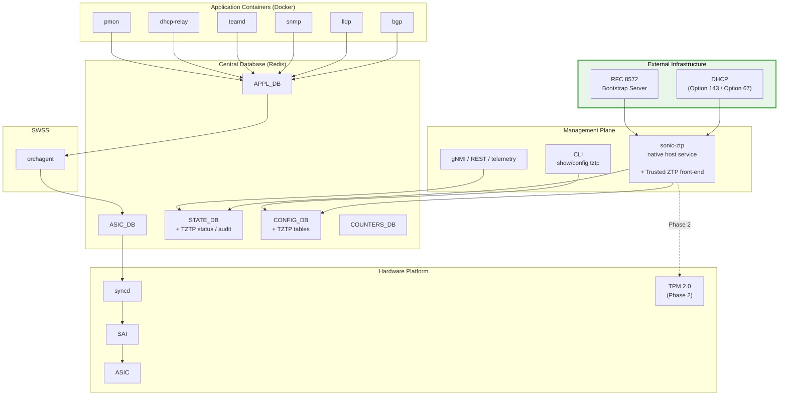

*Figure 4 : Trusted ZTP mapped onto the standard SONiC architecture. The change is confined to the native ZTP service, the CLI, and two database tables; the SWSS / syncd / SAI / ASIC stack is untouched*

### 8. High-Level Design 

Within the `sonic-ztp` service, Trusted ZTP introduces a secure front-end architecture where each module is responsible for a specific function. This separation of responsibilities improves maintainability, security, and flexibility.

The implementation reuses the RFC 8572 Secure Zero Touch Provisioning client (`sztp-agent`), which is isolated behind a dedicated adapter layer. This design ensures that the SZTP client can be upgraded, modified, or replaced without affecting other components of the Trusted ZTP framework.

#### Zero Touch Provisioning using 'sztp-agent' 

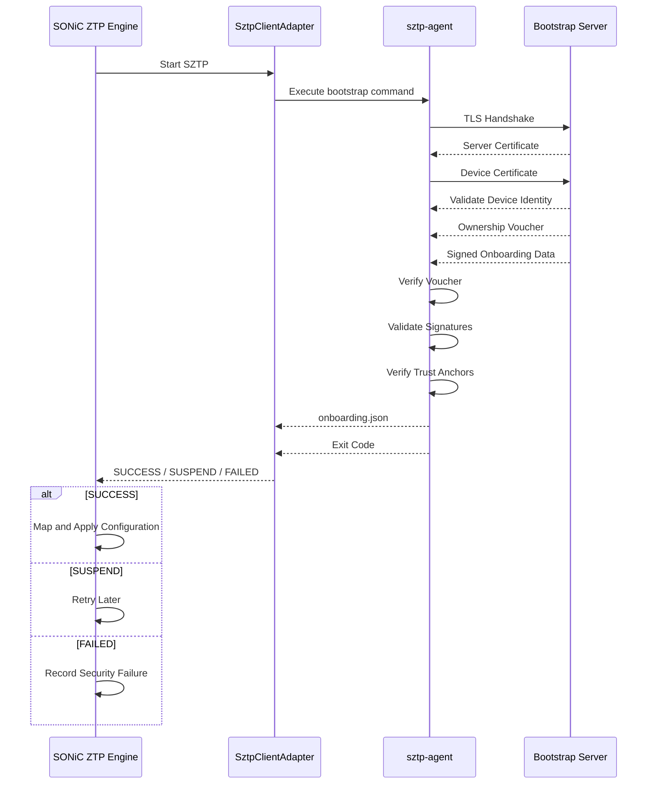

*Figure 5 : End-to-End Provisioning using 'sztp-agent'*

- Each module has a single, well-defined responsibility.
- The architecture separates security-critical functions from other processing tasks.
- The RFC 8572 client (`sztp-agent`) is encapsulated behind an adapter interface.
- Changes to the SZTP client have minimal impact on the rest of the system.
- The modular design simplifies maintenance, testing, and future enhancements.

### 8.1 Key Design Principle: Establishing Trust

Before a factory-fresh switch accepts any configuration, five things indicated below must line up. The table is the roadmap; each row builds Trust in ZTP.

| Building block | Answers |
|:---|:---|
| **Trust plane** | *"Am I to provision securely, and whom do I trust?"* | 
| **Trust model** | *"How may I accept the bootstrapping data?"* | 
| **Trust chain** | *"Is this configuration genuine?"* | 
| **Device identity** | *"Is it for this switch, and can I prove which switch I am?"* | 
| **Trust-plane integrity** | *"Can I trust the trust plane itself?"* |

#### 01. **Trust plane** 
A brand-new switch has an empty CONFIG_DB (which ZTP is about to fill), so it cannot read its security settings from there. Instead it reads them from a small, read-only file placed on the switch at the factory or during staging, /etc/sonic/tztp/bootstrap.json. This file specify enforced mode setting.

#### 02. **Trust model** 
RFC 8572 offers two ways to accept bootstrapping data; the trust plane's trust_model picks one:

- **Trusted-server (unsigned data).** The switch is pre-loaded at the factory with the CA it should trust and validates the server's TLS certificate against it. It accepts the data only after the server is authenticated. Simple, but each factory image is tied to one owner's CA.

- **Voucher-anchored (signed data, RFC 8572).** The switch accepts data from *any* server — even one whose TLS certificate it cannot validate — *as long as the data is signed and backed by an ownership voucher*. This lets one generic, owner-independent factory image work anywhere, so it is the **recommended default**.
 
#### 03. **Trust chain** 

On the signed-data path the switch verifies below five links, each against something it already trusts:

- **Voucher is real** — signed by the **manufacturer**, checked against the manufacturer certificate built into the switch.

- **Voucher is current** — SZTP vouchers carry an **expiry**, so an expired voucher is rejected even if its signature is fine.

- **Owner is identified** — the voucher pins the owner's certificate; the **owner certificate** delivered with the config must match or chain to it.

- **Owner signed the config** — the config's signature must come from that **same owner certificate**.

- **Config is for this switch** — the voucher's **serial number** must equal the switch's own serial.

#### 04. **Device identity**

Trusted ZTP requires every device to possess a unique identity that is cryptographically tied to the switch's hardware serial number. The implementation differs between Phase 1 and Phase 2, but the core requirement remains the same: **each switch must have its own unique cryptographic identity**.

A shared certificate or common key embedded into a software image is not acceptable because it would break the association between the device identity and the hardware serial number, undermining ownership verification.

**Phase 1: File-Based Device Identity** : Phase 1 uses a software-based identity model to ensure compatibility with existing hardware platforms.

**Phase 2: TPM-Based IDevID** : Phase 2 introduces a hardware-rooted identity using a TPM (Trusted Platform Module) 2.0.

##### Identity Requirements
Regardless of the implementation phase:
- Every switch must have a unique identity.
- Identity must be bound to the device serial number.
- Shared certificates or image-wide keys are prohibited.
- Ownership validation depends on the uniqueness of the device identity.

Bootstrapt Server Certificate Validation required in Trusted Server (Direct) mode and Owner Voucher would be required in Voucher Anchor mode.

#### 05. **Trust-plane integrity**

Trust-Plane Integrity determines whether the device can trust the security configuration and trust anchors that guide the onboarding process. This includes components such as:
- `bootstrap.json`
- Trusted CA certificates
- Ownership-validation configuration
- Trust anchors used during secure provisioning

---

### 8.2 Trusted ZTP Components Overview

During a successful secure provisioning process:
1. The Trusted ZTP front-end receives provisioning requests.
2. The adapter communicates with the RFC 8572 `sztp-agent`.
3. The `sztp-agent` performs secure provisioning operations.
4. Provisioning data is validated and processed by the appropriate modules.
5. The root-level configuration engine applies the approved configuration to the device.

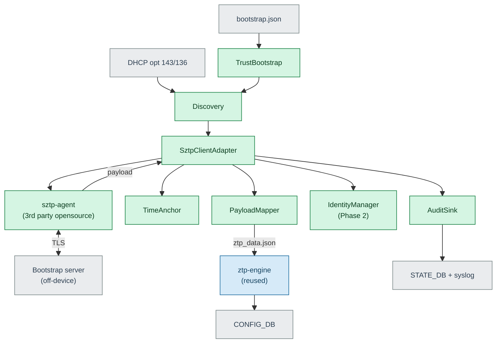
*Figure 6 : Trusted ZTP internal components and secure data flow. The reused client (blue) is isolated behind `SztpClientAdapter`; the new modules (green) establish trust and hand a validated payload to the reused engine, which applies it. External inputs and databases are grey.*

#### Component Responsibilities

Trusted ZTP enhances the existing SONiC ZTP service by introducing seven lightweight modules while reusing two existing components. The reused components handle the complex operations such as cryptographic validation and configuration deployment, while the new modules integrate secure provisioning capabilities into SONiC.

Each component is designed with a single, clearly defined responsibility. They are,
1. TrustBootstrap
2. Discovery
3. SztpClientAdapter
4. TimeAnchor
5. PayloadMapper
6. AuditSink
7. IdentityManager
8. sztp-agent
9. ztp-engine.py and Plugins

#### 01. TrustBootstrap
**Type:** New 

Responsible for loading the read-only `bootstrap.json` file during startup. It determines the device's trust model and ensures that all required trust information is available. If any mandatory trust material is missing, the module immediately stops the provisioning process (fail-closed behavior) to prevent insecure onboarding.

`bootstrap.json` is a small, **read-only** file placed on the switch at the factory or during staging, `/etc/sonic/tztp/bootstrap.json`, only `TrustBootstrap` module reads this file.

```json
{
  "tztp_bootstrap": {
    "schema_version": "1.0",
    "trusted_mode": true,
    "enforce": true,
    "discovery": ["dhcp-opt143", "dhcp-opt136", "static"],
    "static_servers": ["https://bootstrap.example.net"], 
    "trust_model": "voucher-anchored",
    "require_ownership_voucher": true,
    "tls_supported_version": "TLSv1.3",
    "identity_source": "file",
    "device_cert": "/etc/sonic/tztp/device.crt",
    "device_key": "/etc/sonic/tztp/device.key",
    "trust_anchors_path": "/etc/sonic/tztp/trust/",
    "sztp_client": "sztp-agent",
    "sztp_client_version_range": ">=0.2.0,<0.3.0"
  }
}
```

#### 02. Discovery
**Type:** New 

Discovers bootstrap server information using DHCP Option 143/136 or static configuration. DHCP option 143 is for IPv4 and 136 is for IPv6. In enforced secure mode, it rejects legacy discovery methods that do not meet Trusted ZTP security requirements.

###### Trusted Zero-Touch Provisioning (tZTP) DHCP Options
```text
Option Code: 143/136
Purpose: Carries the SZTP bootstrap server information (typically a list of HTTPS URLs).
Transport: DHCPv4/DHCPv6
Format: Encoded as a DHCP option payload containing one or more bootstrap server URIs as defined by RFC 8572 implementations.
```

##### DHCP Option 143 (IPv4)
```text
+--------+--------+-----------------------+
| Code   | Length | URL List              |
+--------+--------+-----------------------+
| 143    |   n    | https://ztp.example.com
+--------+--------+-----------------------+
```

##### DHCPv6 Option 136
```text
+--------+--------+-----------------------+
| Code   | Length | URL List              |
+--------+--------+-----------------------+
| 136    |   n    | https://ztp.example.com
+--------+--------+-----------------------+
```
			  
#### 03. SztpClientAdapter
**Type:** New 

Acts as an abstraction layer between SONiC and the RFC 8572 Secure Zero Touch Provisioning (SZTP) open-source client. This is the only module aware of the underlying implementation of the SZTP client. It is a thin wrapper layer that runs 'sztp-agent' and understand its result, but shall not entangle in its internals.

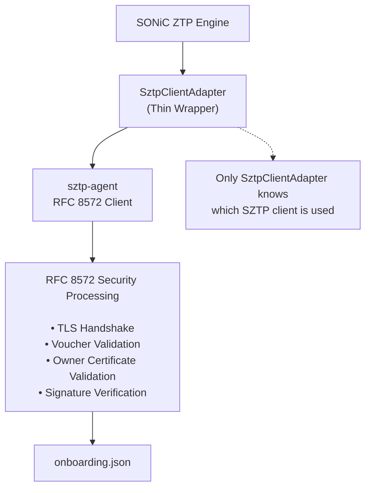
*Figure 7 : SZTP Client Adapter Architecture*

`SztpClientAdapter` executes the `sztp-agent` client and translates the results into existing SONiC provisioning outcomes, so the existing handling simply works:

| Client exit code | Meaning | Engine outcome |
|:----------------:|:--------|:---------------|
| 0 | Payload validated | **SUCCESS** — go on to map and apply it |
| 2 | Try again later (server unreachable, redirect pending, DHCP not ready) | **SUSPEND** — retry after the configured delay |
| other non-zero | A security check failed (voucher, owner certificate, signature, or TLS) | **FAILED** — record why, apply nothing |

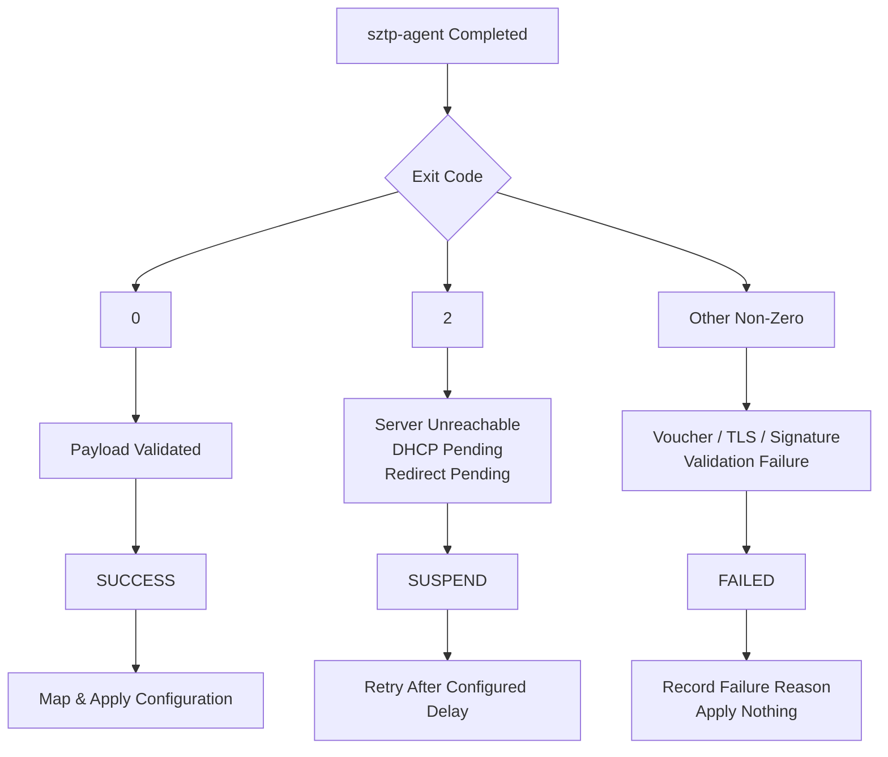
*Figure 8 : SztpClientAdapter Exit Code to SONiC Outcome Mapping*

#### 04. TimeAnchor
**Type:** New 
**Purpose:** Establish a trusted system time when the device clock is incorrect or uninitialized.

Factory-fresh switches often boot without a valid clock and may default to a timestamp such as **January 1, 1970**. An incorrect system time can cause certificate validation failures because certificate validity periods cannot be accurately checked.

##### Process

1. **Detect Invalid System Time**
   - The device checks whether the current system clock is valid.
   - If the clock is incorrect or appears uninitialized, the TimeAnchor process is triggered.

2. **Establish Trusted Time**
   - After the ownership voucher has been successfully validated, the device uses the voucher's `created-on` timestamp as a trusted time reference.
   - This provides a secure temporary time source for certificate and security validation.

3. **Enforce a Monotonic Time Floor**
   - The system never allows the clock to move backward beyond the last known-good timestamp.
   - This prevents attackers from replaying an older voucher to re-establish ownership using expired credentials or outdated trust information.

4. **Re-validate After NTP Synchronization**
   - Any certificates, signatures, or trust decisions validated using the voucher-anchored time are re-verified once accurate time is obtained from an NTP server.
   - This ensures that temporary time anchoring does not become a permanent trust source.

##### Supported Time Validation Policies

- `strict`
  - Requires an accurate system clock before performing trust validation.

- `voucher-anchored`
  - Temporarily uses the validated voucher's `created-on` timestamp as the trusted time source.

- `ntp-first`
  - Waits for NTP synchronization before proceeding with certificate-based validation.

The selected policy is recorded in audit logs and system logs for traceability.

##### Security Benefits
- Enables secure certificate validation on devices with invalid clocks.
- Prevents trust failures during initial factory provisioning.
- Protects against replay attacks that attempt to reuse older ownership vouchers.
- Ensures all trust decisions are re-validated once accurate network time becomes available.


#### 05. PayloadMapper
**Type:** New 

The sztp-agent explicitly supports downloading artifacts securely over HTTPS/FTPS and verifying them locally using SHA-256 hashes. Hence, every artifact named by the onboarding information — boot image, configuration, and scripts — shall be downloaded and integrity-verified from sztp client and that shall be referenced in the generated provisioning data (i.e. ztp_data.json) via local file:// path.

PayloadMapper does this operation of converting the validated provisioning payload received through SZTP into SONiC's standard provisioning format, `ztp_data.json`, allowing the existing ZTP framework to process it without modification. The generated provisioning data shall contain local file:// path and no remote URL.

Sample Format:
```json
{
  "ztp": {
    "restart-ztp-no-config": false,
    "restart-ztp-on-failure": false,
    "halt-on-failure": true,
    "ignore-result": false,

    "00-tztp-pre-script": {
      "plugin": { "name": "provisioning-script" },
      "ignore-section-data": true,
      "provisioning-script": {
        "url": { "source": "file:///var/lib/ztp/tztp/artifacts/pre.sh" }
      }
    },
    "01-tztp-firmware": {
      "install": {
        "url": { "source": "file:///var/lib/ztp/tztp/artifacts/sonic.bin" },
        "set-default": true
      },
      "reboot-on-success": true
    },
    "02-tztp-config": {
      "clear-config": true,
      "save-config": true,
      "url": { "source": "file:///var/lib/ztp/tztp/artifacts/config_db.json" }
    },
    "99-tztp-post-script": {
      "plugin": { "name": "provisioning-script" },
      "ignore-section-data": true,
      "provisioning-script": {
        "url": { "source": "file:///var/lib/ztp/tztp/artifacts/post.sh" }
      }
    }
  }
}
```

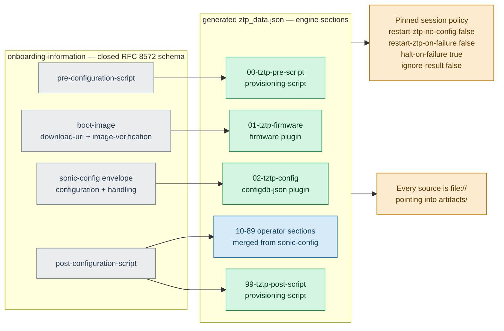

*Figure 9 : Section synthesis. The RFC's four fields (grey) become generated sections in the reserved ranges (green); an operator `sonic-config` envelope of format `ztp-json` contributes sections 10–89 (blue). The two amber boxes are the properties that make the result safe to hand to the engine.*


#### 06. AuditSink
**Type:** New 

Records provisioning status, security events, and audit information into SONiC's `STATE_DB` and system logs. This provides visibility and traceability for provisioning operations.


#### 07. IdentityManager
**Type:** New (Phase 2)

Manages hardware-based device identities stored in the TPM, including:

- Initial Device Identity (IDevID)
- Local Device Identity (LDevID)

It also handles secure certificate and key renewal operations while ensuring the private keys remain protected.


#### 08. sztp-agent
**Type:** 3rd-party Open-source : Reused (Go)

The existing RFC 8572 Secure Zero Touch Provisioning client responsible for:

- TLS communication
- Voucher validation
- Signature verification
- Secure payload retrieval
- Provisioning progress reporting

This component performs the core cryptographic and secure communication functions required for Trusted ZTP.

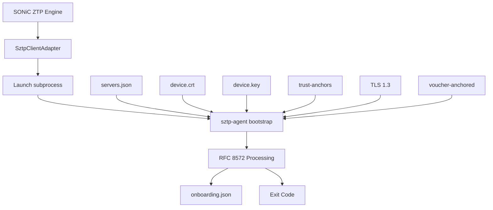

*Figure 10 : 3rd-party open-source SZTP-Agent Security Processing Architecture - RFC 8572 Secure Bootstrapping Processing Flow*

#### 09. ztp-engine.py and Plugins
**Type:** Reused (Python)

The existing SONiC configuration engine that applies:

- Boot images
- Device configurations
- Provisioning scripts

No changes are required to this component. It continues to perform configuration deployment using the validated data provided by Trusted ZTP.

---

### 8.3 Impacted SONiC Repositories
The impact per repository and data store is summarised below.

| SONiC component | Impact | What changes |
|:----------------|:-------|:-------------|
| `sonic-ztp` | New modules; existing engine unchanged | A secure front-end (seven new modules) runs ahead of the existing engine |
| `sonic-buildimage` | Modified | Vendors the `sztp-agent` `.deb`, adds the DHCP option-143 configuration, and (Phase 2) the TPM userspace stack |
| `sonic-yang-models` | New model | `sonic-tztp.yang` with the security constraints |
| `sonic-utilities` | New CLI | `show` / `config tztp` commands |
| `sonic-mgmt` | New tests | Trusted ZTP test plan |
| SAI / orchagent / syncd / ASIC | **None** | No data-plane or hardware-abstraction impact |


### 8.4 Mode Selection Design 

Trusted ZTP is **off by default and must be opted into**. At the very start of provisioning, the switch decides which path to take — secure or legacy — and, in one specific setting, may fall back from secure to legacy. This has to be exactly right, because a switch that has not opted in must behave just like SONiC does today.

**Where the choice comes from.** The switch looks for `trusted_mode` in the trust-plane file - bootstrap.json (new switch) or in CONFIG_DB (already-configured switch). If it is set nowhere, it is **false**. Together with the `enforce` flag, this gives three modes:

| `trusted_mode` | `enforce` | Behaviour |
|:--------------:|:---------:|:----------|
| false | — | **Default.** Legacy ZTP only; no change from today. |
| true | false | **Transition mode.** Try Trusted ZTP first; fall back to legacy ZTP only if the secure path cannot even be started. For staged rollout; *not fully secure*. |
| true | true | **Secure-only.** Legacy option-67/239 discovery and unauthenticated transports are switched off; any missing trust material or failed check stops provisioning. Blocks downgrade attacks. |

The `TRUST_FALLBACK_LEGACY` audit event marks a transition-mode fallback. The full start-up decision — including both the default and the transition-mode fallback — is shown below.

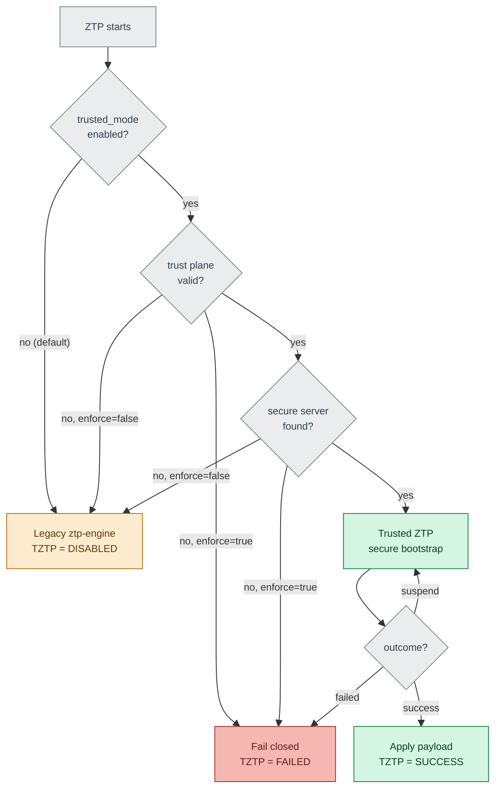

*Figure 11 : Start-up mode selection. Green = secure path, amber = legacy path, red = fail-closed, grey = decision points. The default (`trusted_mode=false`) and the transition-mode fallback both route to the unchanged legacy engine; an active trust-validation failure never falls back to legacy*


### 8.5 Provisioning Workflow

#### 8.5.1 Successful Bootstrap (Voucher-Anchored)

The following sequence shows a successful secure provisioning using the recommended voucher-anchored model.

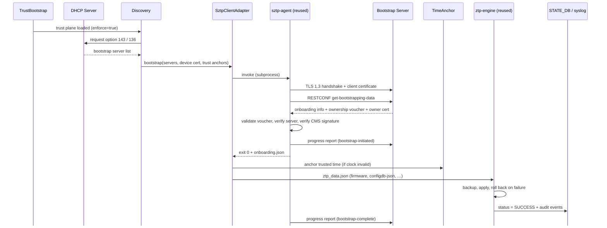
*Figure 12 : Successful voucher-anchored provisioning*

**Step by step:**

1. **Trust posture loaded** — `TrustBootstrap` reads `bootstrap.json` (here `enforce=true`) and starts `Discovery`.
2. **Secure discovery** — `Discovery` requests DHCP option 143/136 and receives the bootstrap-server list (legacy option 67 is never consulted).
3. **Hand to the adapter** — `Discovery` calls `SztpClientAdapter` with the server list, the device certificate, and the trust anchors.
4. **Invoke the client** — the adapter runs `sztp-agent` as a subprocess.
5. **Connect and request** — `sztp-agent` opens TLS 1.3 to the server (presenting the client certificate where available) and calls `get-bootstrapping-data`.
6. **Receive artifacts** — the server returns the onboarding information, the ownership voucher, and the owner certificate.
7. **Validate trust** — `sztp-agent` runs the five-link chain: voucher signature and freshness → owner pinned by the voucher → CMS signer *is* that owner → serial matches this switch.
8. **Report progress** — the agent sends a `bootstrap-initiated` report to the server.
9. **Return the payload** — on success the agent exits `0` and writes `onboarding.json`.
10. **Anchor time** — the adapter sets trusted time from the voucher (only if the clock was invalid).
11. **Apply** — the adapter passes `ztp_data.json` to the engine, which backs up, applies atomically, and rolls back on any failure.
12. **Record and finish** — the engine writes `status = SUCCESS` with audit events, and the agent sends `bootstrap-complete`.


#### 8.5.2 Trust-Validation Failure (Fail-Closed)

If any trust check fails, the device stops and applies nothing. In enforced mode there is no fallback to the legacy path.

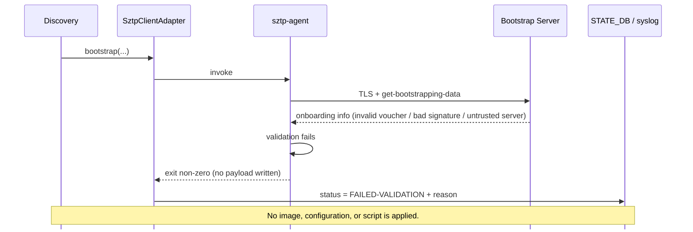
*Figure 13 : Fail-closed behaviour on any trust failure*

**Step by step:**

1. **Bootstrap invoked** — `Discovery` → `SztpClientAdapter` → `sztp-agent`, exactly as in the success flow.
2. **Connect and request** — `sztp-agent` opens TLS and calls `get-bootstrapping-data`.
3. **Bad artifact returned** — the server responds with data that fails a check: an invalid or expired voucher, a bad CMS signature, or an untrusted server.
4. **Validation fails** — one of the five trust-chain links does not hold, so the agent rejects the data.
5. **No payload** — the agent exits non-zero and writes **no** `onboarding.json`.
6. **Record the failure** — the adapter writes `status = FAILED-VALIDATION` with the reason.
7. **Fail closed** — nothing (image, configuration, or script) is applied; in enforced mode there is **no** fallback to the legacy path.


#### 8.5.3 Legacy Provisioning (Secure Option Disabled)

When Trusted ZTP is not opted in — `trusted_mode = false` (the default), or a transition-mode fallback because no secure server was offered — the switch runs the existing ZTP flow unchanged. It is shown here for contrast: it carries today's weak security posture, which Trusted ZTP is designed to replace.

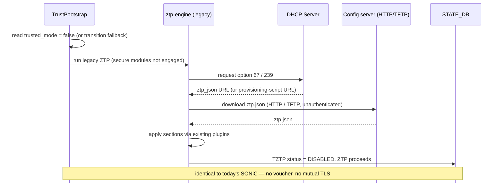
*Figure 14 : Legacy provisioning when the secure option is disabled*

**Step by step:**

1. **Posture check** — `TrustBootstrap` reads `trusted_mode = false` (the default), or falls back here in transition mode because no secure server was offered.
2. **Route to legacy** — control passes to the existing `ztp-engine`; the Trusted ZTP modules never start, and STATE_DB shows `TZTP status = DISABLED`.
3. **Legacy discovery** — the engine requests DHCP option 67 (ZTP-JSON URL) / 239 (provisioning-script URL), exactly as today.
4. **Download** — the engine fetches `ztp.json` over HTTP/TFTP/FTP — **unauthenticated** (no voucher, no mutual TLS).
5. **Apply** — the engine runs the provisioning sections through the existing plugins.
6. **Record** — normal ZTP status is reported; behaviour is bit-for-bit identical to today's SONiC.

---

### 9. SAI API 

No SAI API changes are required. Trusted ZTP operates wholly within the SONiC management plane and does not interact with the ASIC, `orchagent`, `syncd`, or SAI.

---

### 10. Implementation Phasing
The work is delivered in phases so that Phase 1 provides real security on today's hardware without waiting for hardware-dependent capabilities.

| Phase | Objective | Trust depth | Hardware requirement | Where specified |
|:-----:|:----------|:------------|:---------------------|:----------------|
| **1** | Trusted ZTP in SONiC userspace | Voucher and certificate (file-based identity) | None — runs today | This HLD |
| **2** | Hardware-rooted identity | TPM 2.0 and IEEE 802.1AR IDevID/LDevID with EST | TPM and factory IDevID | Follow-up HLD |
| **Out Of Scope** | Close the ONIE image-download window | Authenticated NOS image retrieval | ONIE support | Future (opencomputeproject/onie) |

---

### 11. Configuration and management 

#### 11.1.  Runtime Configuration

Trusted ZTP runtime configuration extends the first-boot trust configuration and adds operational controls that can be managed after deployment. The final storage location is still under discussion and may either use a dedicated `TZTP` table or extend the existing ZTP configuration framework.

##### Example Configuration

```json
{
  "tztp": {
    "trusted_mode": true,
    "enforce": true,
    "trust_model": "voucher-anchored",
    "require_ownership_voucher": true,
    "tls_supported_version": "TLSv1.3",
    "identity_source": "file",
    "enrollment_retry_count": 3,
    "enrollment_retry_delay_sec": 30
  }
}
```

#### 11.2. Config DB Enhancements : The complete field set (CONFIG_DB TZTP|global):

| Parameter | Default Value | Description |
|------------|---------------|-------------|
| `trusted_mode` | `false` | Master switch for Trusted ZTP. When disabled, the device operates using legacy SONiC ZTP only. |
| `enforce` | `false` | Enables secure-only onboarding. When enabled, legacy discovery methods and insecure transports are disabled, and onboarding follows a fail-closed model. |
| `trust_model` | `voucher-anchored` | Defines the trust establishment mechanism. Supported values are `voucher-anchored` and `trusted-server`. |
| `require_ownership_voucher` | `true` | Requires a valid ownership voucher during onboarding. Cannot be disabled when Trusted ZTP is enabled. |
| `dhcp_option_source` | `option_143` | Specifies the DHCP option used for bootstrap server discovery. `option_67` is not allowed when Trusted ZTP is enabled. |
| `tls_supported_version` | `TLSv1.3` | Defines the minimum TLS version permitted for secure communications. TLS 1.2 and earlier versions are rejected. |
| `identity_source` | `file` | Specifies the source of device identity credentials. Supported values are `file` (Phase 1) and `tpm` (Phase 2). |
| `allow_file_based_idevid` | `true` | Determines whether file-based IDevID credentials are allowed. Set to `false` to require TPM-backed device identity. |
| `enrollment_retry_count` | `3` | Maximum number of retries for onboarding operations that return a retryable (`SUSPEND`) status. |
| `enrollment_retry_delay_sec` | `30` | Delay, in seconds, between enrollment retry attempts. |
| `trusted_time` | `voucher-anchored` | Defines the clock-handling policy when the device boots without a valid system time. Supported values include `strict`, `voucher-anchored`, and `ntp-first`. |
| `tpm_idevid_handle` | `0x81010001` | TPM persistent handle used to store the Initial Device Identity (IDevID). Available in Phase 2 deployments. |
| `tpm_ldevid_handle` | `0x81010002` | TPM persistent handle used for the active Local Device Identity (LDevID). Available in Phase 2 deployments. |
| `tpm_ldevid_staging_handle` | `0x81010003` | Temporary TPM handle used during crash-safe LDevID renewal operations. Available in Phase 2 deployments. |
| `ldevid_renewal_before_expiry_days` | `90` | Number of days before certificate expiry when LDevID renewal should be initiated. |
| `allow_onboarding_scripts` | `false` | Controls execution of RFC 8572 onboarding scripts. When disabled, onboarding is limited to configuration-only operations. |
| `mgmt_vrf` | `default` | Specifies the VRF used for Trusted ZTP communication sessions. Common values include `default` and `mgmt`. |
| `discovery_interfaces` | `auto` | Defines the interfaces used for bootstrap server discovery. If not specified, interfaces are selected automatically. |

##### Configuration Source of Truth and Precedence

Trusted ZTP configuration can originate from two sources:

| Source | Purpose |
|----------|----------|
| `bootstrap.json` (Factory Trust Plane) | Loaded during first boot before `CONFIG_DB` exists. Defines the device's initial trust posture and security controls. |
| `CONFIG_DB (TZTP \ global)` | Runtime configuration used after onboarding. Managed through CLI, gNMI, or management frameworks. |


#### 11.3 YANG model Enhancements 

The yang model `sonic-tztp.yang` is detailed below and it describes the CONFIG_DB `TZTP|global` contents. 

```yang
module sonic-tztp {

    yang-version 1.1;
    namespace "http://github.com/sonic-net/sonic-tztp";
    prefix tztp;

    organization "SONiC";
    contact      "SONiC ZTP / Security Working Group";

    description
      "Trusted ZTP (RFC 8572 Secure Zero Touch Provisioning) configuration for
       SONiC. Models the CONFIG_DB TZTP|global table. The 'must' constraints make
       an insecure configuration unrepresentable while trusted_mode is enabled.";

    revision 2026-08-06 {
        description "Initial revision.";
        reference  "RFC 8572; RFC 8366; RFC 7030; IEEE 802.1AR.";
    }

    /* ------------------------------- typedefs ------------------------------- */

    typedef tpm-handle {
        type string {
            pattern '0x[0-9A-Fa-f]{8}';
        }
        description "A TPM 2.0 persistent object handle, e.g. 0x81010001.";
    }

    typedef https-uri {
        type string {
            length  "1..1024";
            pattern 'https://.*';
        }
        description "An https:// URL. Non-TLS schemes are not permitted.";
    }

    /* --------------------------------- data --------------------------------- */

    container sonic-tztp {
      container TZTP {
        container global {

          description
            "Global Trusted ZTP configuration (CONFIG_DB key TZTP|global).";

          /* ----- master switches ----- */

          leaf trusted_mode {
              type boolean;
              default false;
              description
                "Master switch. When false (default) the device runs the existing
                 legacy ZTP unchanged.";
          }

          leaf enforce {
              type boolean;
              default false;
              description
                "When true, secure-only: legacy option-67/239 discovery and
                 unauthenticated transports are disabled and any missing trust
                 material or failed check fails closed. When false (transition mode)
                 the device may fall back to legacy ZTP if the secure path cannot be
                 attempted.";
          }

          /* ----- trust model ----- */

          leaf trust_model {
              type enumeration {
                  enum "trusted-server";
                  enum "voucher-anchored";
              }
              default "voucher-anchored";
              description
                "RFC 8572 trust model. 'trusted-server' validates the server
                 certificate against a factory-pinned CA; 'voucher-anchored'
                 (RFC 8572 section 5.4) verifies the server via the ownership voucher.";
          }

          leaf require_ownership_voucher {
              type boolean;
              default true;
              must "not(. = 'false' and ../trusted_mode = 'true')" {
                  error-message
                    "require_ownership_voucher cannot be disabled while trusted_mode is true";
              }
              description "Require a valid RFC 8366 ownership voucher.";
          }

          /* ----- discovery and transport ----- */

          leaf dhcp_option_source {
              type enumeration {
                  enum "option_143";   // DHCPv4 SZTP redirect
                  enum "option_136";   // DHCPv6 SZTP redirect
                  enum "option_67";    // legacy DHCPv4 config URL
              }
              default "option_143";
              must "not(. = 'option_67' and ../trusted_mode = 'true')" {
                  error-message
                    "option_67 is not permitted while trusted_mode is true";
              }
              description "Where the bootstrap-server / redirect URI is read from.";
          }
          /*For Future Use (if deployments require this support)*/
          leaf-list static_servers {
              type https-uri;
              description
                "Static bootstrap-server URLs, used when DHCP discovery is not
                 available. Tried in order; RFC 8572 redirects are honoured.";
          }

          leaf tls_supported_version {
              type enumeration {
                  enum "TLSv1.3";
              }
              default "TLSv1.3";
              description "Minimum TLS version; lower versions are rejected.";
          }

          leaf allow_unsigned_fallback {
              type boolean;
              default false;
              must "not(. = 'true' and ../trusted_mode = 'true')" {
                  error-message
                    "allow_unsigned_fallback is prohibited while trusted_mode is true";
              }
              description
                "Test/lab only. Permit applying an unsigned payload. Forbidden in
                 trusted_mode.";
          }

          /* ----- device identity ----- */

          leaf identity_source {
              type enumeration {
                  enum "file";   // Phase 1
                  enum "tpm";    // Phase 2
              }
              default "file";
              description "Source of the device client certificate and key.";
          }

          leaf allow_file_based_idevid {
              type boolean;
              default true;
              must "not(. = 'false' and ../identity_source = 'file')" {
                  error-message
                    "identity_source must be 'tpm' when allow_file_based_idevid is false";
              }
              description
                "When false, forbids file-based identity (identity_source must be
                 'tpm'). Operators on TPM-capable hardware set this false to require
                 the hardware-rooted identity.";
          }

          /* ----- retry policy ----- */

          leaf enrollment_retry_count {
              type uint8 { range "1..10"; }
              default 3;
              description "Attempts for a retryable (SUSPEND) outcome.";
          }

          leaf enrollment_retry_delay_sec {
              type uint32 { range "5..300"; }
              default 30;
              description "Delay between retries, in seconds.";
          }

          /* ----- trusted time ----- */

          leaf trusted_time {
              type enumeration {
                  enum "strict";            // require a valid clock
                  enum "voucher-anchored";  // anchor to voucher created-on
                  enum "ntp-first";         // attempt NTP before validating
              }
              default "voucher-anchored";
              description "Clock policy for a clock-less first boot.";
          }

          /* ----- trust material ----- */

          leaf vendor_ca_bundle {
              type string { length "1..256"; }
              default "/etc/sonic/tztp/trust/vendor-ca.pem";
              description "Vendor CA bundle used to validate the ownership voucher.";
          }

          leaf operator_ca_bundle {
              type string { length "1..256"; }
              default "/etc/sonic/tztp/trust/operator-ca.pem";
              description
                "Operator CA bundle used to validate the server (trusted-server model).";
          }

          /* ----- reused client pin ----- */

          leaf sztp_client {
              type string { length "1..64"; }
              default "sztp-agent";
              description "Name of the packaged RFC 8572 client.";
          }

          leaf sztp_client_version_range {
              type string { length "1..64"; }
              description
                "Accepted client version range, e.g. '>=0.2.0,<0.3.0'. A client outside
                 this range fails the session (CLIENT_VERSION_MISMATCH).";
          }

          /* ----- Phase 2: TPM-backed identity ----- */

          leaf tpm_idevid_handle {
              when "../identity_source = 'tpm'";
              type tpm-handle;
              default "0x81010001";
              description "Phase 2. Persistent TPM handle for the IDevID key.";
          }

          leaf tpm_ldevid_handle {
              when "../identity_source = 'tpm'";
              type tpm-handle;
              default "0x81010002";
              description "Phase 2. Active LDevID key handle.";
          }

          leaf tpm_ldevid_staging_handle {
              when "../identity_source = 'tpm'";
              type tpm-handle;
              default "0x81010003";
              description "Phase 2. Staging handle for crash-safe LDevID renewal.";
          }

          leaf ldevid_renewal_before_expiry_days {
              type uint16 { range "1..365"; }
              default 90;
              description "Phase 2. Renew the LDevID this many days before expiry.";
          }

          leaf allow_onboarding_scripts {
              type boolean;
              default false;
              description
                "Permit execution of RFC 8572 pre/post-configuration scripts, which
                 run with root privilege. When false, only configuration is applied.";
          }
        }
      }
    }
}
```

**Important Security Note**

> **YANG provides configuration validation, not a runtime security boundary.**

The YANG model enforces these constraints only through the **management interfaces**, such as:
- CLI
- gNMI
- Other management-framework APIs

This provides:
- Early validation of configuration changes
- Protection against accidental misconfiguration
- A clear and consistent operational contract for administrators

The effective runtime security posture is enforced by the **Trusted ZTP runtime components**. Runtime configuration stored in `CONFIG_DB` is **not permitted to weaken** these settings. 

---

#### 11.4. Operational State DB Enhancements (STATE_DB)  

Operational visibility is provided by a new STATE_DB table, `TZTP|status`, which does not exist for legacy ZTP:

| Field | Description |
|:------|:------------|
| `state` | `IN-PROGRESS`, `SUCCESS`, `FAILED-VALIDATION`, `SUSPEND`, or `DISABLED` |
| `trust_model` | `trusted-server` or `voucher-anchored` |
| `bootstrap_server` | The server that provided the onboarding information |
| `voucher_valid` | Whether the ownership voucher validated |
| `server_verified` | Whether the server was authenticated |
| `owner_subject` | Subject of the validated owner certificate |
| `sztp_client` / `sztp_client_version` | The reused client and its version |
| `client_provision_result` | `OK`, or the typed error (`MTLS_FAIL`, `VOUCHER_FAIL`, `CMS_FAIL`, `VERSION_MISMATCH`) |
| `clock_policy` | Trusted-time policy applied on this boot|
| `ldevid_issued` | (Phase 2) whether an LDevID was enrolled |
| `ldevid_expiry` | (Phase 2) LDevID expiry, ISO-8601 |
| `last_error` | Populated on failure |
| `timestamp` | ISO-8601 time of the last transition |

* The ISO-8601 standard formats date and time from largest to smallest units, using a 24-hour clock and a "T" separator
* Example: 2026-08-20T10:30:00Z, where Z means UTC

**Durable Audit Trail**

Each phase transition writes both a STATE_DB audit entry (`TZTP_AUDIT|{timestamp}|{event}`) and a system-log record tagged `tztp`. 

The main events would be:
| Event | Trigger |
|:------|:--------|
| `MTLS_HANDSHAKE_OK` / `FAIL` | TLS mutual-authentication result |
| `VOUCHER_VERIFY_OK` / `FAIL` | Ownership-voucher (RFC 8366) validation result |
| `CMS_VERIFY_OK` / `FAIL` | Payload signature validation result |
| `EST_ENROLL_OK` / `FAIL` | (Phase 2) LDevID enrollment via EST |
| `CONFIG_APPLY_OK` / `FAIL` | Configuration apply / rollback result |
| `TRUST_FALLBACK_LEGACY` | Transition-mode fallback to legacy taken  |
| `TRUST_DOWNGRADE_BLOCKED` | Enforced mode blocked a legacy fallback |
| `CLIENT_VERSION_MISMATCH` | Installed client is outside the pinned version range |

---

#### 11.5. CLI

Trusted ZTP adds commands to SONiC's standard Click-based CLI, provided by `sonic-utilities`. The **`show tztp *`** commands are read-only, read from STATE_DB and are available to any user. All commands are no-ops when the feature is compiled out.

#### Command List:

| Command | Type | Purpose |
|:--------|:-----|:--------|
| `show tztp status` | show | Current provisioning status and trust results |
| `show tztp audit [--last <n>]` | show | Recent audit events |

##### `show tztp status`

**Description.** Displays the current Trusted ZTP state — the mode, the trust model in use, the bootstrap server contacted, the outcome of voucher and server validation, the reused client version, and the overall result. Reads `STATE_DB TZTP|status`.

**Example.**
```
admin@sonic:~$ show tztp status
Trusted ZTP      : enabled (enforce = true)
Trust model      : voucher-anchored
Bootstrap server : https://bootstrap.example.net
Voucher valid    : true
Server verified  : true
Owner            : CN=example-owner
SZTP client      : sztp-agent 0.2.0  (pinned >=0.2.0,<0.3.0, OK)
Status           : SUCCESS
```

##### `show tztp audit [--last <n>]`

**Description.** Displays the durable Trusted ZTP audit trail from `STATE_DB TZTP_AUDIT|*`, newest last. Each row is one phase transition. This is the first place to look when diagnosing a failed or fallen-back provisioning attempt.

**Options.** `--last <n>` — limit the output to the most recent `n` events (default: all events for the current session).

**Example.**
```
admin@sonic:~$ show tztp audit --last 5
TIMESTAMP             EVENT                DETAIL
2026-08-01T10:15:02Z  MTLS_HANDSHAKE_OK    bootstrap.example.net
2026-08-01T10:15:03Z  VOUCHER_VERIFY_OK    owner CN=example-owner
2026-08-01T10:15:03Z  CMS_VERIFY_OK        -
2026-08-01T10:15:07Z  CONFIG_APPLY_OK      -
2026-08-01T10:15:07Z  STATUS               SUCCESS
```
---

### 12. Warmboot and Fastboot Design Impact  

Trusted ZTP runs only during initial provisioning (factory default or an explicit `ztp run`) and is not part of the warm or fast reboot data path. The reused client performs no background processing and holds no state outside a single bootstrap invocation, so warm-reboot compatibility is inherited automatically.

| Event | Behaviour |
|:------|:----------|
| Warm reboot | The engine reads STATE_DB; if provisioning is complete it enters renewal-monitor mode (Phase 2). The client is not invoked. |
| Fast reboot | Identical to warm reboot. |
| Factory reset | STATE_DB is cleared and any LDevID is deleted (Phase 2); the IDevID and TPM state persist. Trusted ZTP re-runs on the next boot. |
| Power loss during bootstrap | Because the design is fail-closed, nothing has been applied. On the next boot the reconciler (Phase 2) repairs any partial identity state and provisioning is retried. |
| Reboot to install a boot image (during provisioning) | **Not** a warm/fast reboot. The secure-ZTP session is marked in-progress in `/host/ztp`, and on the next boot bootstrapping **restarts** on the new image and applies the configuration (§11.4). |

---

### 13. Restrictions/Limitations  

- **Requires a bootstrap server.** The mature server (Watsen) is proprietary; `google/open-sztp` is the open-source candidate but is young and needs an interoperability gate.
- **Phase 1 device identity is file-based.** It relies on a pre-installed device certificate and operator-provisioned trust anchors; it does not establish identity from a hardware root of trust until Phase 2.
- **DHCPv6-only networks.** If only option 136 is available, client support must be confirmed; otherwise enforced mode may be restricted to dual-stack in Phase 1 .
- **Reused client is written in Go.** SONiC invokes it as a subprocess, which adds a Go build and runtime artifact to the image.
- **Phase-1 identity and trust plane are software-strength** — a per-unit file certificate and filesystem-protected trust plane. Hardware-rooted identity and a measured trust plane are Phase 2.
- **Multi-ASIC and modular-chassis** provisioning (supervisor + line cards, per-ASIC namespaces) is not yet specified.
- **Trust-anchor rotation** (expired or compromised vendor/operator CA) is not yet specified.
- **Feature across image upgrade** — behaviour when a Trusted-ZTP-provisioned device is upgraded to an image without the feature (or vice-versa) is not yet specified.

---

### 14. Testing Requirements/Design  

#### 14.1. Unit Test cases  
Unit tests run with the client mocked, so they require no live TPM, network, or bootstrap server (NFR-6).

| ID | Area | Verifies |
|:---|:-----|:---------|
| UT-1 | TrustBootstrap | Missing or invalid `bootstrap.json` with `enforce=true` fails closed; legacy ZTP is not started |
| UT-2 | Discovery | Option 143/136 parsed correctly; option 67 rejected in enforced mode |
| UT-3 | SztpClientAdapter | Exit codes 0/2/other map to SUCCESS/SUSPEND/FAILED; typed errors surfaced |
| UT-4 | SztpClientAdapter | A client version outside the pinned range halts with `CLIENT_VERSION_MISMATCH` |
| UT-5 | PayloadMapper | Onboarding payload maps to the correct provisioning sections |
| UT-6 | TimeAnchor | An invalid clock is anchored to the voucher `created-on` timestamp |
| UT-7 | Config apply | An apply failure restores the backup |
| UT-8 | AuditSink | Each outcome writes both a STATE_DB entry and a system-log record |
| UT-9 | YANG | Insecure configuration combinations are rejected by the model |


#### 14.2. Functional and Integration Test cases

| ID | Scenario | Expected outcome |
|:---|:---------|:-----------------|
| FT-1 | Valid voucher and configuration (both trust models) | SUCCESS; configuration applied |
| FT-2 | Invalid or expired voucher | FAILED; nothing applied |
| FT-3 | Incorrect owner certificate | FAILED |
| FT-4 | Tampered CMS signature | FAILED; existing configuration preserved |
| FT-5 | Server certificate not chaining to the trust anchor (trusted-server model) | Aborts at TLS; FAILED |
| FT-6 | Redirect chain (server A → server B) | Redirect followed; SUCCESS |
| FT-7 | Bootstrap server temporarily unreachable | SUSPEND, then SUCCESS on recovery |
| FT-8 | Enforced mode with a legacy option-67 offer present | Legacy ignored; secure path only |
| FT-9 | `trusted_mode=false` | Legacy ZTP unchanged (regression guard) |
| FT-10 | Clock-less boot (invalid RTC) | Time anchored; validation succeeds |
| FT-11 | Server offering only TLS 1.2 | Rejected; FAILED |
| FT-12 | Payload names a new boot image | Image installed, device reboots, bootstrapping restarts and applies config (§11.4) |
| FT-13 | Replayed or expired voucher (valid signature, stale nonce/`expires-on`) | FAILED; nothing applied |
| FT-14 | Malformed or oversized voucher/payload | Rejected cleanly; FAILED; no crash |
| FT-15 | Clock-less boot in voucher-anchored mode (server cert `notBefore` in the past) | TLS proceeds with relaxed expiry, voucher validated, time anchored; SUCCESS |

---

### 15. Open/Action items 

---

### 16. Appendix A: The Core Concept of Trusted ZTP : Device Identity = Serial Number Embedded in a Certificate

>
> **A device's identity is its serial number, stored inside a unique device certificate.**

Rather than identifying devices using IP addresses, hostnames, or manually maintained inventories, Trusted ZTP uses a cryptographic identity. Each switch receives its own certificate containing the device serial number, and that certificate becomes the device's identity during onboarding.

#### How It Works

1. Each switch is provisioned with a unique device certificate (DevID).
2. The device serial number is embedded in the certificate's Subject or Subject Alternative Name (SAN).
3. During onboarding, the switch connects to the bootstrap server using mutual TLS (mTLS).
4. The bootstrap server extracts the serial number directly from the certificate.
5. The serial number is used to locate the onboarding profile assigned to that device.
6. The server returns the correct onboarding information for that specific switch.

#### Device Certificate Example

```text
┌──────── Device Certificate (DevID) ─────────┐
│ Subject:                                    │
│    serialNumber = first-serial-number       │
│                                             │
│ Signed By: Device Identity CA               │
└─────────────────────────────────────────────┘
```

The serial number embedded in the certificate is the device's identity.

#### Bootstrap Server Mapping

The bootstrap server is configured to extract the serial number from the client certificate and use it as a lookup key.

```text
┌──────── Bootstrap Server (SZTP) ────────────────────────┐
│ Serial Number Extraction:                               │
│   wn-x509-c2n:serial-number                             │
│                                                         │
│ Device Mapping:                                         │
│                                                         │
│ first-serial-number  → first-onboarding-profile         │
│ second-serial-number → second-onboarding-profile        │
│ third-serial-number  → third-onboarding-profile         │
└─────────────────────────────────────────────────────────┘
```

#### End-to-End Flow

```text
┌───────────────────┐
│ Device Certificate│
│ Serial: Device123 │
└─────────┬─────────┘
          │
          │ Mutual TLS
          ▼
┌───────────────────┐
│ Bootstrap Server  │
│ Extract Serial    │
│ = Device123       │
└─────────┬─────────┘
          │
          │ Lookup Device123
          ▼
┌───────────────────┐
│ Onboarding Profile│
└─────────┬─────────┘
          │
          ▼
   Boot Image
   Configuration
   Pre-Script
   Post-Script
```

#### Phase 1 vs Phase 2
The onboarding logic remains exactly the same in both phases.

| Phase 1 | Phase 2 |
|----------|----------|
| Serial number stored in a file-based device certificate | Serial number stored in an IEEE 802.1AR TPM-backed IDevID |
| Private key stored on disk | Private key stored inside TPM |
| Software-strength identity | Hardware-rooted identity |
| Same serial lookup process | Same serial lookup process |

The only change is where the private key is stored. The identity model and trust flow remain unchanged.

Trusted ZTP identifies a switch by reading the serial number embedded inside its device certificate. During mutual TLS onboarding, the bootstrap server extracts this serial number and uses it to retrieve the correct onboarding profile, including the boot image, configuration, and scripts assigned to that switch. 
**This serial-number-based identity model is the foundation of the entire Trusted ZTP design and works consistently across both file-based (Phase 1) and TPM-backed (Phase 2) implementations.**

---

### 17. Appendix B : PKI Trust Hierarchy

Trusted ZTP relies on a Public Key Infrastructure (PKI) consisting of two Certificate Authorities (CAs): a **Vendor CA** owned by the hardware manufacturer and an **Operator CA** owned by the network operator. Understanding which CA signs which artifacts makes the trust model straightforward.

### Certificate Authorities

#### Vendor CA

The Vendor CA is typically kept offline and protected within a secure signing environment.

Responsibilities:

- Signs per-device identities (IDevID) in Phase 2.
- Signs RFC 8366 ownership vouchers.
- Acts as the root of trust for device ownership validation.

Every switch ships with the Vendor CA certificate pre-installed, enabling it to verify ownership vouchers immediately during onboarding.

#### Operator CA

The Operator CA is managed by the organization that owns and operates the network.

Responsibilities:

- Signs bootstrap server TLS certificates.
- Issues operational device certificates (LDevID).
- Supports enrollment and renewal workflows.

The device learns to trust the Operator CA through one of two trust models:

- **Trusted-Server Model**: Operator CA is pre-installed during manufacturing.
- **Voucher-Anchored Model**: The ownership voucher authorizes establishment of trust in the Operator CA.

### Device Certificates

Trusted ZTP uses two device identities.

| Certificate | Purpose | Lifetime | Owner |
|-------------|----------|----------|--------|
| **IDevID** | Permanent factory identity | Long-lived | Hardware manufacturer |
| **LDevID** | Operational identity used after onboarding | Renewable | Network operator |

#### IDevID (Initial Device Identity)

- Permanent device identity.
- Unique per switch.
- Factory installed.
- TPM-protected in Phase 2.
- Used to establish device authenticity.

#### LDevID (Local Device Identity)

- Issued during onboarding.
- Represents current device ownership.
- Used for day-to-day authentication.
- Renewable throughout device lifecycle.

---

### 18. Appendix C : How Phase1 works without a TPM

Most current whitebox platforms do not provide a factory-installed TPM-backed IDevID. To enable secure onboarding on existing hardware, Phase 1 introduces a file-based identity model that provides equivalent functionality.


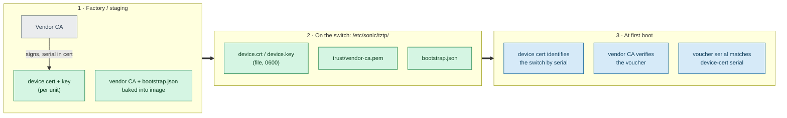
*Figure 15 : Phase-1 realization: a per-unit device certificate and CA files stand in for the TPM.*

#### Step 1: Factory or Staging Provisioning

During manufacturing or staging:

- A unique certificate and private key are generated for each switch.
- The device serial number is embedded into the certificate Subject or SAN.
- The certificate is signed by the Vendor CA.
- The SONiC image is prepared with:
  - Vendor CA certificate
  - Optional Operator CA certificate
  - `bootstrap.json` trust plane

#### Step 2: Files Installed on the Device

The device receives the following files:

```text
/etc/sonic/tztp/
├── device.crt
├── device.key
├── trust/
│   └── vendor-ca.pem
└── bootstrap.json
```

##### File Security
```text
device.key
Owner: root
Permissions: 0600
```

This ensures only privileged processes can access the private key.

#### Step 3: First Boot Validation

During onboarding:

1. The device certificate identifies the switch.
2. The Vendor CA validates the ownership voucher.
3. The voucher contains the expected device serial number.
4. The switch verifies that:
   - Voucher serial number matches device certificate serial number.
5. Secure onboarding proceeds only if validation succeeds.


**Phase 1 Trust Flow**

```text
Factory / Staging
-----------------
Vendor CA
     |
     +--> Signs Device Certificate
     |
     +--> Vendor CA + bootstrap.json
          embedded into image


Device Files
------------
device.crt
device.key
vendor-ca.pem
bootstrap.json


First Boot
----------
device certificate identifies switch
           |
vendor-ca verifies ownership voucher
           |
voucher serial matches device serial
           |
secure onboarding continues
```
---

### 19. Appendix D : Device Configuration using Voucher Anchor Mode

#### Overview
In RFC 8572 (Secure Zero Touch Provisioning / SZTP), the Voucher-anchor trust mode is one of the method a brand-new network device uses to trust an on-premise Bootstrap Server. This mode is designed for "blind deployment" scenarios, where the network device has never met its owner's server before. Instead of relying on pre-installed server certificates, the device relies on a Voucher signed by the manufacturer to establish a dynamic chain of trust.

#### How it works
When a device boots up in a factory-default state, it has no idea who its owner is. It cannot verify the local Bootstrap Server's standard SSL/TLS certificate because it does not possess the owner’s root CA. To solve this, trust is proxied through the device Manufacturer. Switch uses a mix of hardware identities and manufacturer-signed digital tickets called Vouchers to prove ownership, by following below steps.

##### Step 1: The Hardware Identity (SUDI / IDevID)
When a switch leaves the factory, the manufacturer burns a unique identity directly into the TPM 2.0 silicon. 
- This identity includes a Private Key (locked inside the TPM chip) and a matching Public Key Certificate.
- This is called the Secure Unique Device Identifier (SUDI) or Initial Device Identifier (IDevID).
- It includes the switch’s exact Serial Number and is signed by the manufacturer's global root certificate authority (CA).

##### Step 2: The Owner Claims the Switch (Offline Setup)
When user purchase the switch, the manufacturer registers its serial number to user's account on their portal. 
- User shall provide the manufacturer with their company's public certificate, called the Pinned-Domain Certificate (PDC). 
- The manufacturer creates a digital file called an Ownership Voucher (OV). 
- Inside this voucher, the manufacturer states: "We built switch serial #12345, and it now officially belongs to Company XYZ's public key." 
- The manufacturer cryptographically signs this voucher using their own private key and gives it to user. User shall place it on their Bootstrap server.

##### Step 3: The Cryptographic Handshake (During Boot)
When the switch boots up empty in user's data centre, it performs a 4-step validation sequence to establish total trust:


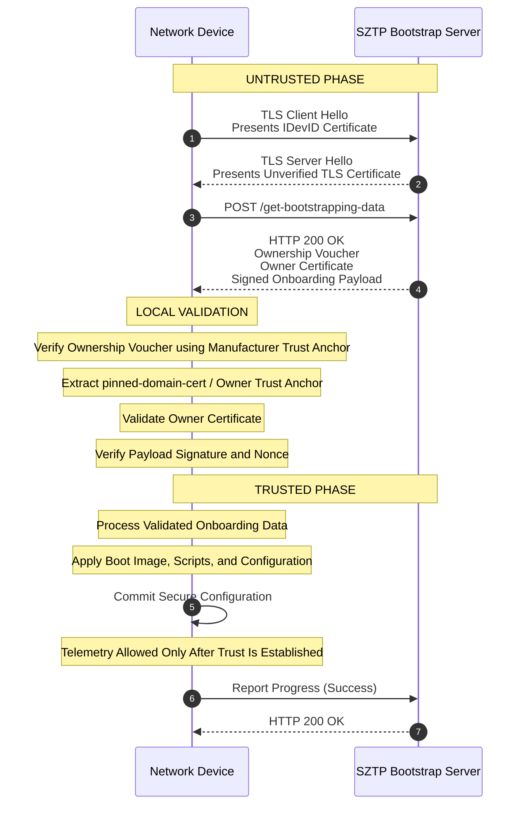
*Figure 16 : Untrusted-to-Trusted SZTP Bootstrap Workflow*

**Step 1 & 2: The Initial Untrusted TLS Session**
- The switch boots, receives Option 143 via DHCP, and opens a connection to user's central Bootstrap server. 
- The device sends a TLS Client Hello presenting its hardware-baked IDevID certificate (signed by the TPM).
- The Bootstrap server verifies that the certificate is legitimate and then responds with its TLS certificate. At this moment, the device cannot verify this server certificate. However, the protocol allows the device to provisionally proceed with the TLS session anyway to fetch the necessary trust artifacts.

**Step 3 & 4: Fetching the Bootstrapping Artifacts**
- Operating over this provisionally encrypted, yet unverified TLS connection, the device sends a RESTCONF POST request to the /get-bootstrapping-data endpoint.
- The Bootstrap Server responds with an ietf-sztp-bootstrap-server container containing three tightly linked components:
  	- The Ownership Voucher: Signed by the manufacturer. 
  	- The Owner Certificate: The server's identity certificate.
  	- The Onboarding Information: The encrypted configuration files and scripts.

**Step 5: Chain of Trust Validation (Inside the Switch)**
The switch receives this payload and must validate it without relying on external internet connections:
- Validation A (Trusting the Voucher): The switch’s local OS contains an immutable public key for its own manufacturer. It checks the signature on the Ownership Voucher. Because it matches the manufacturer, the switch instantly trusts the voucher.
- Validation B (Learning the Owner): The switch reads the trusted voucher. It finds the Pinned-Domain Certificate inside it. The switch now thinks: "Ah! The manufacturer says I belong to Company XYZ. This is their public key."
- Validation C (Trusting the Configuration): The switch uses this newly acquired Company XYZ public key to verify the signature on your Config JSON/Scripts.

If all cryptographic checks pass, the session transitions into the **Trusted Phase**.

**Step 6: Execution and Progress Reporting**
- Now that the server is authenticated, the device trusts the Onboarding Information payload.
- The device processes the configuration, executes scripts, and installs required OS images.
- Finally, it uses the secure channel to send a formal progress report back to the server, confirming the setup succeeded.

---

### 20. Appendix E : Device Configuration using Trusted Server Mode

#### Overview
The below sequence illustrates how a network device securely onboards through **RFC 8572 Secure Zero Touch Provisioning (SZTP)** by establishing mutual trust with a Trusted Bootstrap Server, retrieving onboarding information, executing provisioning tasks, and reporting progress throughout the process in Trusted Server (Direct) mode.

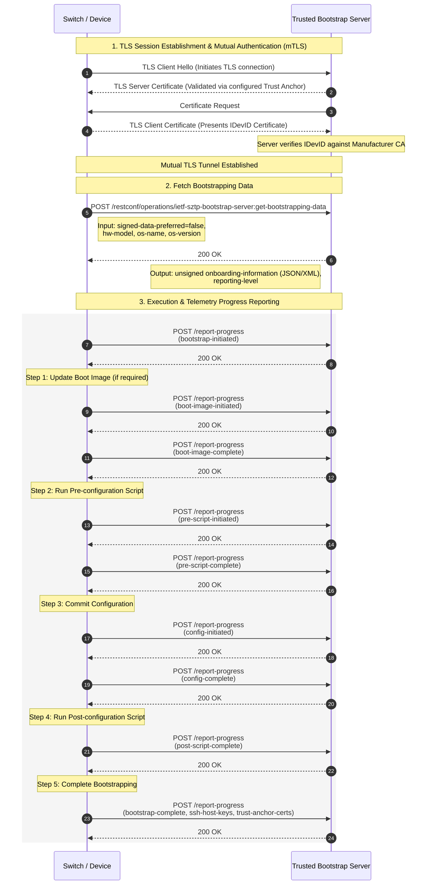
*Figure 17 : Trusted Bootstrap Server Onboarding Workflow (mTLS-Based)*
	
#### 1. TLS Session Establishment and Mutual Authentication (mTLS)
Before any provisioning data is exchanged, both the device and the bootstrap server authenticate each other using certificates.

##### Sequence
1. Device initiates a TLS connection (`Client Hello`).
2. Bootstrap Server presents its TLS server certificate.
3. Device validates the server certificate using a trusted CA anchor.
4. Server requests a client certificate.
5. Device presents its **IDevID (Initial Device Identity)** certificate.
6. Bootstrap Server validates the IDevID against the manufacturer CA.
7. A secure **Mutual TLS (mTLS)** tunnel is established.

##### Security Objective
- Authenticate the bootstrap server.
- Authenticate the device using hardware-bound identity.
- Protect all subsequent provisioning traffic with encryption and integrity.

#### 2. Fetch Bootstrapping Data
Once the secure channel is established, the device requests onboarding information.

##### Device Request
The device sends a:
```text
get-bootstrapping-data
```
Including:
- Hardware model
- Operating system name
- Operating system version
- Provisioning preferences

##### Server Response
The Bootstrap Server returns:
- Onboarding information
- Provisioning instructions
- Reporting parameters

##### Security Objective
- Deliver authenticated provisioning data.
- Ensure bootstrap information is exchanged only over the trusted mTLS channel.

#### 3. Provisioning Execution and Telemetry Reporting
The device executes the onboarding workflow while continuously reporting progress to the Bootstrap Server.

##### Bootstrap Initiation
```text
report-progress
bootstrap-initiated
```
##### Step 1: Update Boot Image (Optional)
The device updates its software image if required.

##### Progress Events
```text
boot-image-initiated
boot-image-complete
```

##### Purpose
- Install or upgrade the required NOS image.
- Ensure the device runs the expected software version.

##### Step 2: Run Pre-Configuration Script
The device executes any prerequisite setup actions.

#### Progress Events
```text
pre-script-initiated
pre-script-complete
```

##### Purpose
- Perform preparatory tasks.
- Configure dependencies before applying the main configuration.

##### Step 3: Commit Configuration
The device applies the intended operational configuration.

##### Progress Events
```text
config-initiated
config-complete
```

##### Purpose
- Configure interfaces, protocols, credentials, and services.
- Bring the device into the desired operational state.

##### Step 4: Run Post-Configuration Script
Additional deployment actions are executed after configuration is applied.

##### Progress Events
```text
post-script-complete
```

##### Purpose
- Perform validation checks.
- Execute post-deployment customization tasks.

##### Step 5: Complete Bootstrapping
The device reports successful completion of provisioning.

##### Final Progress Report
```text
bootstrap-complete
ssh-host-keys
trust-anchor-certs
```

##### Purpose
- Confirm successful onboarding.
- Provide operational trust information to the Bootstrap Server.

---
