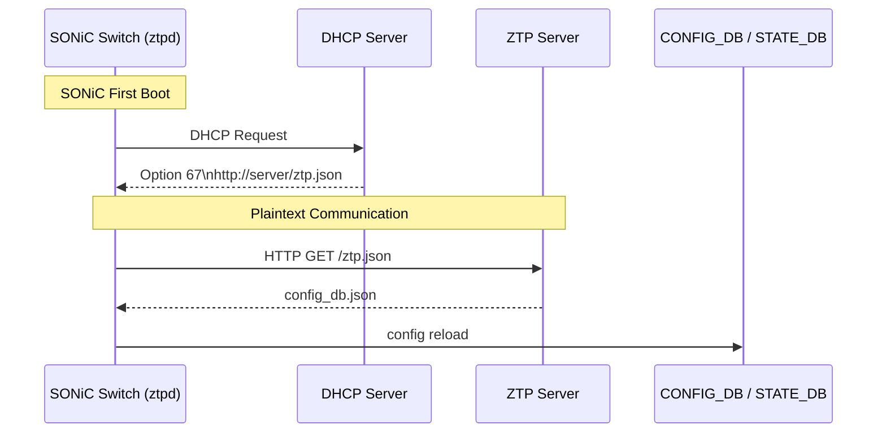
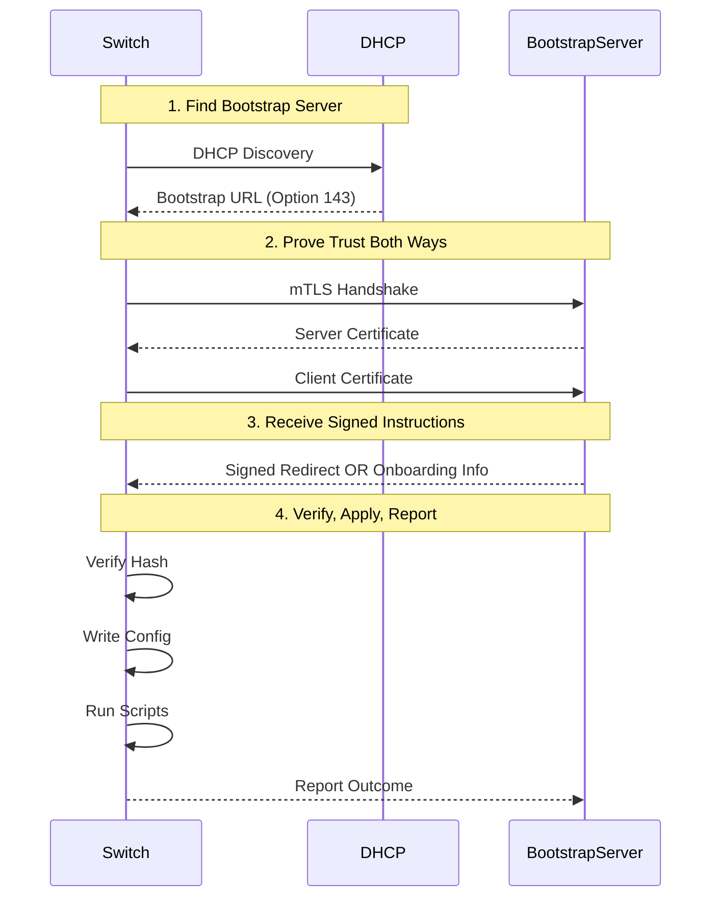
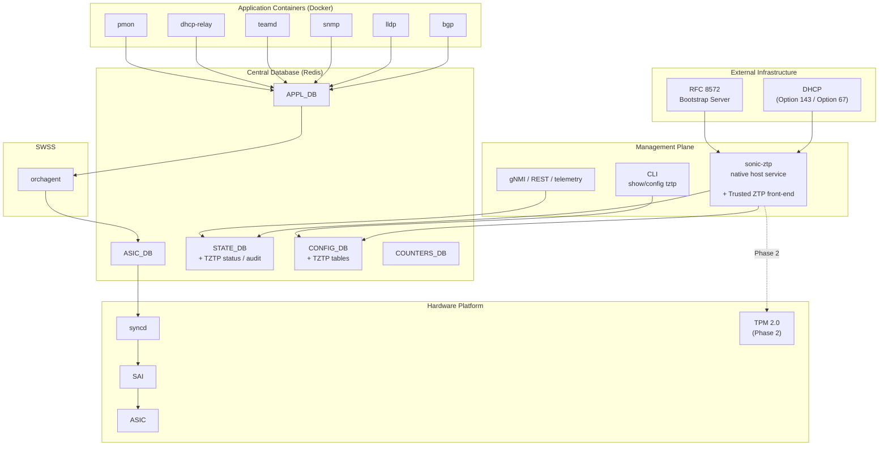
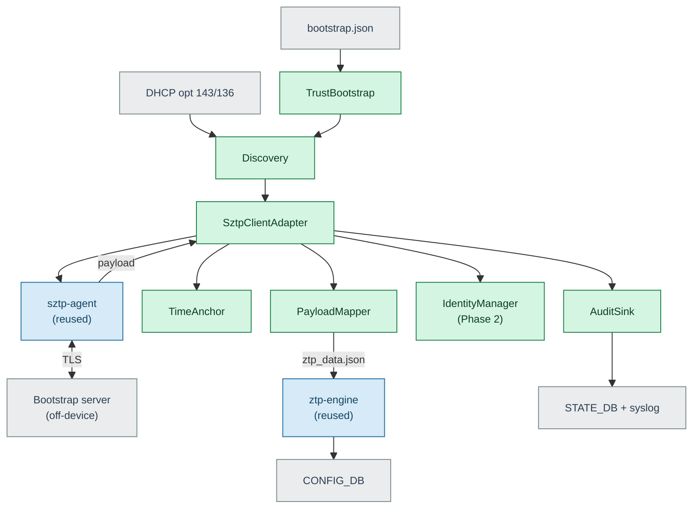

# Trusted Zero Touch Provisioning (Trusted ZTP) for SONiC

## High Level Design Document

**Feature:** Trusted ZTP (tZTP) — RFC 8572 Secure Zero Touch Provisioning for SONiC
**Version:** 1.0
**Status:** Draft — submitted for SONiC community HLD review
**Target release:** To be assigned by the SONiC TSC

---

## Table of Contents

1. [Revision History](#1-revision-history)
2. [About This Document](#2-about-this-document)
3. [Scope](#3-scope)
4. [Definitions and Abbreviations](#4-definitions-and-abbreviations)
5. [Overview](#5-overview)
6. [Requirements](#6-requirements)
7. [Architecture](#7-architecture)
8. [High-Level Design](#8-high-level-design)

### 1. Revision History  

| Version | Date | Author | Description |
|:-------:|:-----|:-------|:------------|
| 1.0 | 2026-08-06 | T Keerthi Kumar, Sandeep K | Initial draft. |


### 2. About This Document  

This High Level Design (HLD) proposes **Trusted ZTP (tZTP)** — a standards-based, cryptographically secured onboarding capability for SONiC based on **RFC 8572 (Secure Zero Touch Provisioning)**.

The design is intentionally conservative: it **augments** the existing `sonic-ztp` service rather than replacing it, **reuses** a mature, permissively licensed RFC 8572 implementation rather than writing the security-critical protocol from scratch, and remains **disabled by default** so that existing deployments are unaffected. The recommendations for which open-source components to adopt are backed by primary-source repository data (summarised in [Appendix A](#appendix-a-primary-source-evidence)), not vendor marketing claims.


### 3. Scope  

This document describes **Phase 1** of Trusted Zero Touch Provisioning (tZTP) for SONiC userspace. tZTP extends the existing `ztpd` daemon with cryptographic security without breaking backward compatibility.


**In scope — Phase 1 (this document):**

- RFC 8572 secure bootstrapping on the SONiC device (the *pledge*), over authenticated TLS 1.3 to a bootstrap server (mutual TLS with the IDevID in Phase 2).
- Validation of the ownership voucher, the owner certificate, and the CMS signature over the onboarding payload, before any configuration is applied.
- Integration with the existing `sonic-ztp` engine and its plugin model, so that validated payloads are applied through today's provisioning path.
- An immutable first-boot trust plane (`bootstrap.json`), support for both RFC 8572 trust models, and trusted-time handling for clock-less first boot.
- Configuration expressed as a YANG model, operational visibility in STATE_DB with a durable audit trail, and CLI.
- DHCP Option 143 (`sztp-redirect`, RFC 8572 §8.1 structured URI list) strict enforcement in trusted mode
- A secure-enable enforcement mode that disables the legacy insecure discovery and transport paths.
- Full backward compatibility with existing ZTP deployments, in secure-disable mode.
- Operation on hardware **without** a TPM, using a file-based device certificate.

**In scope — Phase 2 (design seams defined here; full design in a follow-up HLD):**

- Hardware-rooted device identity using TPM 2.0 and IEEE 802.1AR IDevID/LDevID, with certificate enrollment and renewal.

**Out of scope:**

- The bootstrap server implementation itself, which runs off the device.
- Securing the ONIE-stage NOS image download. 
 
---
### 4. Definitions/Abbreviations 

| Term | Definition |
|------|-----------|
| **tZTP** | Trusted Zero Touch Provisioning — this feature |
| **ZTP** | Zero Touch Provisioning — existing SONiC mechanism (unsecured) |
| **SZTP** | Secure Zero Touch Provisioning — RFC 8572 standard that tZTP implements |
| **IDevID** | Initial Device Identifier — factory-installed, TPM-backed per IEEE 802.1AR-2018 |
| **LDevID** | Local Device Identifier — operational cert issued at provisioning per IEEE 802.1AR-2018 |
| **mTLS** | Mutual TLS — TLS with both client and server certificate verification |
| **EST** | Enrollment over Secure Transport — RFC 7030 |
| **CMS** | Cryptographic Message Syntax — RFC 5652, used for signed config bundles |
| **TPM** | Trusted Platform Module 2.0 — hardware security element |
| **ONIE** | Open Network Install Environment — bare-metal switch bootloader |
| **PKI** | Public Key Infrastructure |
| **CA** | Certificate Authority |
| **CSR** | Certificate Signing Request (PKCS#10) |
| **ztpd** | ZTP Daemon — existing SONiC Python daemon (`sonic-ztp` package) |
| **RFC 8572** | Secure Zero Touch Provisioning |
| **RFC 9646** | CSR in SZTP Bootstrapping Request (Oct 2024) |
| **RFC 8366** | Voucher Artifact for Bootstrapping Protocols |
| **CONFIG_DB** | SONiC configuration database (Redis instance 4) |
| **STATE_DB** | SONiC operational state database (Redis instance 6) |
| **Pledge** | The device being provisioned — here, the SONiC switch. |
| **Bootstrap server** | The RFC 8572 server that returns redirect or onboarding information to the pledge. |
| **Onboarding information** | The signed payload delivered to the pledge: boot image reference, configuration, and optional scripts. |
| **Ownership voucher** | A signed artifact (RFC 8366) that binds a device to its rightful owner. |
| **Trusted-server model** | RFC 8572 trust where the pledge already holds the owner/CA trust anchor. |
| **Voucher-anchored model** | RFC 8572 trust where the server is verified *after* connecting, by validating the voucher. |
| **Owner / owner certificate** | The entity that owns the deployed device and signs its onboarding information; identified by the voucher's `pinned-domain-cert`. |
| **pinned-domain-cert** | The certificate pinned inside the ownership voucher (RFC 8366) that identifies the owner the device must trust. |
| **Manufacturer anchor** | The manufacturer signing trust anchor, baked in at the factory, used to verify the ownership voucher. |
| **CMS SignedData** | The RFC 5652 signed structure wrapping the onboarding information; its signer must be the owner certificate. |
| **Canonical Architecture** | An architecture that uses a single, standard, and shared model for data or design. |
| **HLD** | High Level Design document |

---

### 5. Overview 

### 5.1 The Existing SONiC ZTP Service

SONiC's existing Zero Touch Provisioning (ZTP) automates first-boot configuration of bare-metal switches i.e. it lets a factory-fresh SONiC switch configure itself with no operator interaction. You rack it, cable it, power it on. It uses DHCP to discover where its configuration lives, downloads a provisioning definition (the ZTP JSON), executes an ordered series of plugins — install firmware, load config_db.json, load a minigraph, set SNMP, run custom scripts — and finally hands control to the real, provisioned configuration.

The central design idea: ZTP is temporary scaffolding. It installs a throwaway “ZTP profile” configuration (just enough to bring links up and run DHCP), does its work, then removes itself and reloads the configuration it produced. 

It is widely adopted across data centre deployments. However, as SONiC expands into enterprise, regulated, and edge environments, the current implementation's lack of cryptographic security prevents adoption in security-sensitive contexts.


### 5.2 Motivation: Security Gaps in Today's ZTP (`sonic-ztp`) 

#### Current ZTP Architecture



The existing ZTP flow is functional but **insecure by default** i.e. **Zero touch** is **easy**, but **Zero trust** is the **hard part**. Its discovery relies on DHCP options transmitted in cleartext (DHCPv4 option 67 for the configuration URL, option 66 for a TFTP server, option 239 for a provisioning script; DHCPv6 option 59). It supports unauthenticated transports — HTTP, TFTP, and FTP — alongside HTTPS and SCP, and uses curl to download provisioning data.

Existing plain ZTP has the following trust problems: 

**Threat 1 · rogue server**
The DEVICE trusts whatever server the network points it to i.e. the device trusts anyone who answers via DHCP. Point it at a malicious server and it installs the attacker's image as its "operating system." The box is now owned before it ever joins the network.

**Threat 2 · rogue device**
The server hands an OS + config to anyone who asks. A stolen or counterfeit device asks for onboarding data and walks away with your golden config and firmware.

SONiC ZTP does not rely entirely on standard security mechanisms. Instead, it uses a custom security model with the following protections:

- Configuration files hosted on the provisioning server can be optionally encrypted using **AES encryption**.
- Files can be digitally signed using **RSA/SHA-512 signatures** to ensure their integrity and authenticity.
- The signing keys are embedded into the SONiC image when the firmware is built.
- SONiC can optionally verify the HTTPS server certificate before downloading files.

> **Important:** HTTPS certificate verification can be disabled by setting the following option: `secure: false`

There is no in-band mechanism for a factory-fresh device to establish who it is talking to or whether the payload legitimately belongs to it. Consequently, an attacker positioned on the provisioning network can serve a malicious image or configuration to a switch during its most vulnerable moment — first boot.

The table below states each gap and how Trusted ZTP closes it. The final column indicates the phase in which the gap is fully addressed.

| # | Security gap | Today | Trusted ZTP resolution | Phase |
|:--|:-------------|:------|:-----------------------|:-----:|
| G1 | Device impersonation — any host can request configuration | No device authentication | The config is bound to the device by the voucher's serial; a per-unit file cert (Phase 1) or TPM IDevID (Phase 2) carries that serial | 1 (file) → 2 (IDevID) |
| G2 | Rogue bootstrap server — any server is trusted | No server authentication | Server is trusted only via a pinned owner/CA anchor or a validated ownership voucher | 1 |
| G3 | Cleartext transmission | HTTP / TFTP / FTP permitted | TLS 1.3 only (mutual auth with the IDevID in Phase 2) | 1 |
| G4 | No payload integrity | Files applied as received | RFC 8572 signed onboarding information (CMS) plus voucher | 1 |
| G5 | No identity after provisioning | Shared credentials or manual certificates | LDevID issued for gNMI/RESTCONF | 2 |
| G6 | Insecure discovery | DHCP option 67 / 239 | DHCP option 143 / 136 (RFC 8572), mandatory in enforced mode | 1 |

> **On G1 in Phase 1:** device identity rests on the voucher's serial binding, carried by a per-unit *file* certificate — software-strength. Hardware-bound identity that fully closes G1 arrives with the TPM IDevID in Phase 2.


### 5.3 What Trusted ZTP Adds

tZTP (Trusted ZTP) is a security extension to the existing ZTP mechanism. It implements RFC 8572 (SZTP) in SONiC userspace — adding **secure discovery and trust-establishment stage in front of** that existing service — while remaining fully backward compatible with existing ZTP deployments. Conceptually, today's ZTP performs *"DHCP hands me a URL, I download a configuration."* Trusted ZTP performs *"DHCP hands me a bootstrap server, the device and server prove their identities to each other, and I download a cryptographically signed configuration that I verify against an ownership voucher before applying anything."*

Crucially, **once the payload is validated, nothing about how SONiC applies configuration changes**. The validated payload is translated into SONiC's normal provisioning data and handed to the existing engine and plugins. The new work is confined to *establishing trust and obtaining a verified payload* — not to reimplementing provisioning.

#### The flow in four moves


##### 01. Find the bootstrap server

DHCP hands the switch a single thing: a **URL** (via option 143). Here DHCP is treated as *untrusted* — just a pointer, nothing more.

##### 02. Prove trust both ways

The switch and the server open a **mutual-TLS** connection. Each presents a certificate the other checks. Only if both sides are satisfied does the conversation continue.

##### 03. Receive signed instructions

The server sends **"conveyed information"** — a signed package that's either:

- A **redirect** ("go ask this other server instead"), or
- **Onboarding info** (the actual boot image + config + scripts)

##### 04. Verify, apply, report

The switch downloads the image, **checks its hash**, **writes the config**, **runs pre/post scripts**, and **tells the server** each stage's outcome.

#### Naming — tZTP vs sZTP

The feature is named **tZTP (Trusted ZTP)** rather than sZTP to emphasise that the trust model is the primary contribution: device identity, chain-of-trust from vendor through operator to device, and cryptographically provable configuration provenance. "Secure" is a property of the channel; "Trusted" is a property of the entire provisioning relationship.


### 6. Requirements

### 6.1 Functional Requirements

| # | Requirement | Priority |
|:--|:------------|:--------:|
| FR-1 | With Trusted ZTP disabled (`trusted_mode=false`, the default), the existing ZTP behaviour is completely unchanged. | Must |
| FR-2 | The device shall perform RFC 8572 secure bootstrapping against one or more bootstrap servers. | Must |
| FR-3 | The device shall be identifiable to the server through its ownership voucher's serial binding. Where a device identity certificate is available — an IEEE 802.1AR IDevID (Phase 2) or a per-unit file certificate (Phase 1) — it shall be presented for TLS client authentication. RFC 8572 does **not** require mutual TLS on the signed-data path. | Must |
| FR-4 | The server shall be authenticated either by validating its certificate against a pinned trust anchor (trusted-server model) or by validating the ownership voucher and then retroactively verifying the server (voucher-anchored model, RFC 8572 §5.4). | Must |
| FR-5 | The device shall validate the RFC 8366 ownership voucher, the owner certificate, and the CMS signature over the onboarding information before applying any part of the payload. | Must |
| FR-6 | On any trust-validation failure, the device shall apply no configuration, image, or script (fail-closed). | Must |
| FR-7 | The device shall accept an SZTP redirect and follow the referenced bootstrap servers (bounded to prevent loops). | Must |
| FR-8 | The device shall send RFC 8572 progress reports to a **trusted** bootstrap server (report-progress is defined only over the authenticated connection to a trusted server; it is not available on the signed-data-from-untrusted-server path). | Must |
| FR-9 | Validated onboarding information shall be applied through the existing `sonic-ztp` engine and plugins, with configuration backup and rollback on failure. | Must |
| FR-10 | In enforced mode, the SZTP URL shall be accepted only from DHCP option 143/136; legacy option 67/239 discovery shall be rejected. | Must |
| FR-11 | The initial trust posture shall be read from a read-only `bootstrap.json` at first boot; when `enforce=true` and the trust plane is missing or invalid, the device shall fail closed. | Must |
| FR-12 | The device shall establish trusted time on a clock-less first boot, anchoring to the voucher `created-on` timestamp when the real-time clock is invalid. | Must |
| FR-13 | TLS 1.3 shall be the minimum negotiated version; TLS 1.2 and below shall be rejected. | Must |
| FR-14 | All SONiC modules shall interact with the RFC 8572 client only through a single adapter, so that the client can be replaced without changes elsewhere. | Must |
| FR-15 | Trusted ZTP status, trust results, and an audit trail shall be published to STATE_DB, mirrored durably to the system log, and exposed via CLI. | Must |
| FR-16 | (Phase 2) The device shall support TPM-resident IDevID identity and LDevID enrollment/renewal via EST. | Should |
| FR-17 | Any additional files delivered with the onboarding information shall be covered by the same CMS signature over the conveyed information and shall be rejected if that signature does not verify. | Should |
| FR-18 | The network-facing bootstrapping and parsing (TLS, voucher, CMS, JSON) shall run with reduced privilege — dropped capabilities and a sandbox — separated from the root engine that applies configuration. | Must |
| FR-19 | Trusted time derived from a voucher shall never move the clock backward past the last persisted known-good time (a monotonic floor), to prevent clock-rollback replay. | Must |
| FR-20 | Execution of onboarding pre/post-configuration scripts shall be governed by an `allow_onboarding_scripts` policy; when enabled, scripts run with the engine's (root) privilege. | Should |

### 6.2 Non-Functional Requirements

| # | Requirement | Target |
|:--|:------------|:-------|
| NFR-1 | Backward compatibility with existing deployments | 100% |
| NFR-2 | All new source is Apache-2.0 (or compatible permissive) and free of GPL or proprietary entanglement | Required |
| NFR-3 | No component that cannot be shipped upstream is required on the device | Required |
| NFR-4 | The reused client is vendored at a pinned version; its transitive-dependency licenses are audited in CI | Required |
| NFR-5 | Phase 1 functions on hardware without a TPM or factory IDevID | Required |
| NFR-6 | The feature is unit-testable without a live TPM, network, or bootstrap server (adapter mocked) | Required |
| NFR-7 | Audit records survive cold reboot and power loss | Required |
| NFR-8 | End-to-end provisioning completes within a typical maintenance window | < 5 minutes |

---

### 7. Architecture Design 

Trusted ZTP is an additive, management-plane feature. This section places it in the SONiC architecture, zooms into its internal components and secure data flow in next sectinos.

Trusted ZTP operates entirely in the SONiC **management plane**. It has no interaction with the ASIC, SAI, `orchagent`, or `syncd`. It reads and writes CONFIG_DB and STATE_DB, reads trust material from the filesystem, and — in Phase 2 — uses the TPM. Its only external interaction is an outbound TLS session to the bootstrap server. 

Because the ZTP process handles data received from potentially untrusted networks during initial device boot, the network-facing bootstrap and file-parsing components are designed to run with limited privileges and within a sandboxed environment i.e.

- Network-sourced data is processed in a restricted environment with minimal privileges.
- The bootstrap and parsing components are isolated from critical system functions.
- The root-level configuration engine is separated from the network-facing components.
- If a vulnerability is exploited in the provisioning or parsing process, the impact is limited by the sandbox and privilege restrictions.
- This reduces the risk of unauthorized access to the underlying operating system during the initial provisioning phase.


#### Footprint on the SONiC Architecture

The SONiC community's canonical architecture organises the system as application containers interacting through a **central Redis database**, above the SWSS / `syncd` / SAI stack and the ASIC. Trusted ZTP fits into that picture with a deliberately small footprint: it extends the existing **native `sonic-ztp` host service**, adds a CLI, and adds tables to **CONFIG_DB** and **STATE_DB**. Everything below the database — SWSS, `syncd`, SAI, and the ASIC — **is untouched**.


`

### 8. High-Level Design 

Within the `sonic-ztp` service, Trusted ZTP introduces a secure front-end architecture where each module is responsible for a specific function. This separation of responsibilities improves maintainability, security, and flexibility.

The implementation reuses the RFC 8572 Secure Zero Touch Provisioning client (`sztp-agent`), which is isolated behind a dedicated adapter layer. This design ensures that the SZTP client can be upgraded, modified, or replaced without affecting other components of the Trusted ZTP framework.

### 8.1 Key Design Principles

- Each module has a single, well-defined responsibility.
- The architecture separates security-critical functions from other processing tasks.
- The RFC 8572 client (`sztp-agent`) is encapsulated behind an adapter interface.
- Changes to the SZTP client have minimal impact on the rest of the system.
- The modular design simplifies maintenance, testing, and future enhancements.

### 8.2 tZTP Components & Data Flow

During a successful secure provisioning process:

1. The Trusted ZTP front-end receives provisioning requests.
2. The adapter communicates with the RFC 8572 `sztp-agent`.
3. The `sztp-agent` performs secure provisioning operations.
4. Provisioning data is validated and processed by the appropriate modules.
5. The root-level configuration engine applies the approved configuration to the device.




#### Component Responsibilities

Trusted ZTP enhances the existing SONiC ZTP service by introducing seven lightweight modules while reusing two existing components. The reused components handle the complex operations such as cryptographic validation and configuration deployment, while the new modules integrate secure provisioning capabilities into SONiC.

Each component is designed with a single, clearly defined responsibility.

##### 01. TrustBootstrap
**Type:** New 

Responsible for loading the read-only `bootstrap.json` file during startup. It determines the device's trust model and ensures that all required trust information is available. If any mandatory trust material is missing, the module immediately stops the provisioning process (fail-closed behavior) to prevent insecure onboarding.

`bootstrap.json` is a small, **read-only** file placed on the switch at the factory or during staging, `/etc/sonic/tztp/bootstrap.json`, only `TrustBootstrap` module reads this file.

```json
{
  "tztp_bootstrap": {
    "schema_version": "1.0",
    "trusted_mode": true,
    "enforce": true,
    "discovery": ["dhcp-opt143", "dhcp-opt136", "static"],
    "static_servers": ["https://bootstrap.example.net"],
    "trust_model": "voucher-anchored",
    "require_ownership_voucher": true,
    "tls_minimum_version": "TLSv1.3",
    "identity_source": "file",
    "device_cert": "/etc/sonic/tztp/device.crt",
    "device_key": "/etc/sonic/tztp/device.key",
    "trust_anchors_path": "/etc/sonic/tztp/trust/",
    "sztp_client": "sztp-agent",
    "sztp_client_version_range": ">=0.2.0,<0.3.0"
  }
}
```

##### 02. Discovery
**Type:** New 

Discovers bootstrap server information using DHCP Option 143/136 or static configuration. In enforced secure mode, it rejects legacy discovery methods that do not meet Trusted ZTP security requirements.

##### 03. SztpClientAdapter
**Type:** New 

Acts as an abstraction layer between SONiC and the RFC 8572 Secure Zero Touch Provisioning (SZTP) client. This is the only module aware of the underlying implementation of the SZTP client. It executes the client and translates the results into SONiC provisioning outcomes such as:

- `SUCCESS`
- `SUSPEND`
- `FAILED`

##### 04. TimeAnchor
**Type:** New 

Ensures that the system clock is trustworthy during provisioning. If the device detects an invalid or incorrect time, it derives a trusted timestamp from the voucher's `created-on` field and uses it as a secure time reference.

##### 05. PayloadMapper
**Type:** New 

Converts the validated provisioning payload received through SZTP into SONiC's standard provisioning format, `ztp_data.json`, allowing the existing ZTP framework to process it without modification.

##### 06. AuditSink
**Type:** New 

Records provisioning status, security events, and audit information into SONiC's `STATE_DB` and system logs. This provides visibility and traceability for provisioning operations.

##### 07. IdentityManager
**Type:** New (Phase 2)

Manages hardware-based device identities stored in the TPM, including:

- Initial Device Identity (IDevID)
- Local Device Identity (LDevID)

It also handles secure certificate and key renewal operations while ensuring the private keys remain protected.

##### 08. sztp-agent
**Type:** Reused (Go)

The existing RFC 8572 Secure Zero Touch Provisioning client responsible for:

- TLS communication
- Voucher validation
- Signature verification
- Secure payload retrieval
- Provisioning progress reporting

This component performs the core cryptographic and secure communication functions required for Trusted ZTP.

##### 09. ztp-engine.py and Plugins
**Type:** Reused (Python)

The existing SONiC configuration engine that applies:

- Boot images
- Device configurations
- Provisioning scripts

No changes are required to this component. It continues to perform configuration deployment using the validated data provided by Trusted ZTP.

### 8.3 Impacted SONiC Repositories
The impact per repository and data store is summarised below.

| SONiC component | Impact | What changes |
|:----------------|:-------|:-------------|
| `sonic-ztp` | New modules; existing engine unchanged | A secure front-end (seven new modules) runs ahead of the existing engine |
| `sonic-buildimage` | Modified | Vendors the `sztp-agent` `.deb`, adds the DHCP option-143 configuration, and (Phase 2) the TPM userspace stack |
| `sonic-yang-models` | New model | `sonic-tztp.yang` with the security constraints |
| `sonic-utilities` | New CLI | `show` / `config tztp` commands |
| `sonic-mgmt` | New tests | Trusted ZTP test plan |
| CONFIG_DB | New table | `TZTP` configuration |
| STATE_DB | New tables | `TZTP` status and audit |
| SAI / orchagent / syncd / ASIC | **None** | No data-plane or hardware-abstraction impact |


This section covers the high level design of the feature/enhancement. This section covers the following points in detail.
		
	- Is it a built-in SONiC feature or a SONiC Application Extension?
	- What are the modules and sub-modules that are modified for this design?
	- What are the repositories that would be changed?
	- Module/sub-module interfaces and dependencies. 
	- SWSS and Syncd changes in detail
	- DB and Schema changes (APP_DB, ASIC_DB, COUNTERS_DB, LOGLEVEL_DB, CONFIG_DB, STATE_DB)
	- Sequence diagram if required.
	- Linux dependencies and interface
	- Warm reboot requirements/dependencies
	- Fastboot requirements/dependencies
	- Scalability and performance requirements/impact
	- Memory requirements
	- Docker dependency
	- Build dependency if any
	- Management interfaces - SNMP, CLI, RestAPI, etc.,
	- Serviceability and Debug (logging, counters, trace etc) related design
	- Is this change specific to any platform? Are there dependencies for platforms to implement anything to make this feature work? If yes, explain in detail and inform community in advance.
	- SAI API requirements, CLI requirements, ConfigDB requirements. Design is covered in following sections.


### 8. SAI API 

This section covers the changes made or new API added in SAI API for implementing this feature. If there is no change in SAI API for HLD feature, it should be explicitly mentioned in this section.
This section should list the SAI APIs/objects used by the design so that silicon vendors can implement the required support in their SAI. Note that the SAI requirements should be discussed with SAI community during the design phase and ensure the required SAI support is implemented along with the feature/enhancement.


### 9. Configuration and management 
This section should have sub-sections for all types of configuration and management related design. Example sub-sections for "CLI" and "Config DB" are given below. Sub-sections related to data models (YANG, REST, gNMI, etc.,) should be added as required.
If there is breaking change which may impact existing platforms, please call out in the design and get platform vendors reviewed. 

#### 9.1. Manifest (if the feature is an Application Extension)

Paste a preliminary manifest in a JSON format.

#### 9.2. CLI/YANG model Enhancements 

This sub-section covers the addition/deletion/modification of CLI changes and YANG model changes needed for the feature in detail. If there is no change in CLI for HLD feature, it should be explicitly mentioned in this section. Note that the CLI changes should ensure downward compatibility with the previous/existing CLI. i.e. Users should be able to save and restore the CLI from previous release even after the new CLI is implemented. 
This should also explain the CLICK and/or KLISH related configuration/show in detail.
https://github.com/sonic-net/sonic-utilities/blob/master/doc/Command-Reference.md needs be updated with the corresponding CLI change.

#### 9.3. Config DB Enhancements  

This sub-section covers the addition/deletion/modification of config DB changes needed for the feature. If there is no change in configuration for HLD feature, it should be explicitly mentioned in this section. This section should also ensure the downward compatibility for the change. 

		
### 10. Warmboot and Fastboot Design Impact  
Mention whether this feature/enhancement has got any requirements/dependencies/impact w.r.t. warmboot and fastboot. Ensure that existing warmboot/fastboot feature is not affected due to this design and explain the same.

### Warmboot and Fastboot Performance Impact
This sub-section must cover the impact of the functionality on warmboot and fastboot performance, that is control plane and data plane downtime.
As part of the analysis cover the flowing:

- Does this feature add any stalls/sleeps/IO operations to the boot critical chain? Does it change when this feature is disabled/unused? 
- Does this feature add any additional CPU heavy processing (e.g. rendering Jinja templates) in the boot path (process, library or utility used during boot up)? Does it change when this feature is disabled/unused?
- In case this feature updates a third party dependency does it cause any impact on boot time performance?
- Can the feature (service or docker) be delayed?
- What are the possible optimizations and what is the expected boot time degradation if, by the nature of the feature, additional CPU/IO costs can't be avoided?


### 11. Memory Consumption
This sub-section covers the memory consumption analysis for the new feature: no memory consumption is expected when the feature is disabled via compilation and no growing memory consumption while feature is disabled by configuration. 


### 12. Restrictions/Limitations  


### 13. Testing Requirements/Design  
Explain what kind of unit testing, system testing, regression testing, warmboot/fastboot testing, etc.,
Ensure that the existing warmboot/fastboot requirements are met. For example, if the current warmboot feature expects maximum of 1 second or zero second data disruption, the same should be met even after the new feature/enhancement is implemented. Explain the same here.
Example sub-sections for unit test cases and system test cases are given below. 

#### 13.1. Unit Test cases  

#### 13.2. System Test cases


### 14. Open/Action items - if any 

	
NOTE: All the sections and sub-sections given above are mandatory in the design document. Users can add additional sections/sub-sections if required.
